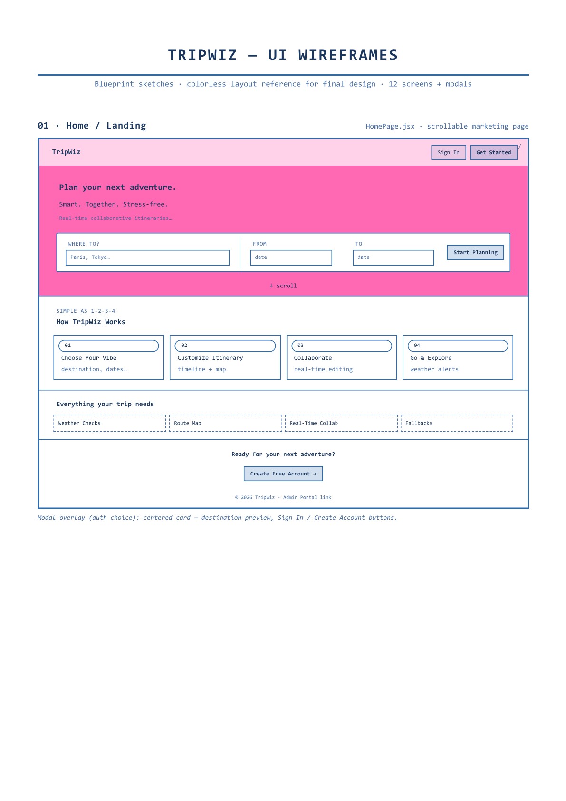
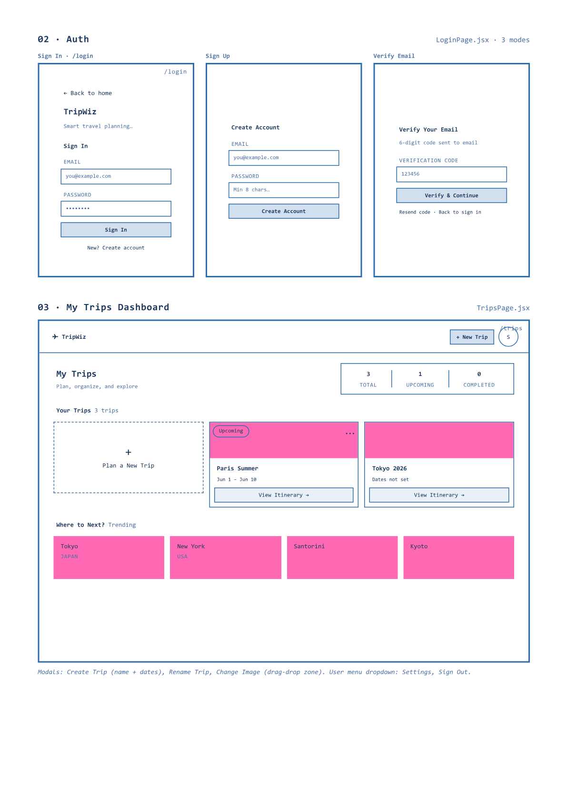
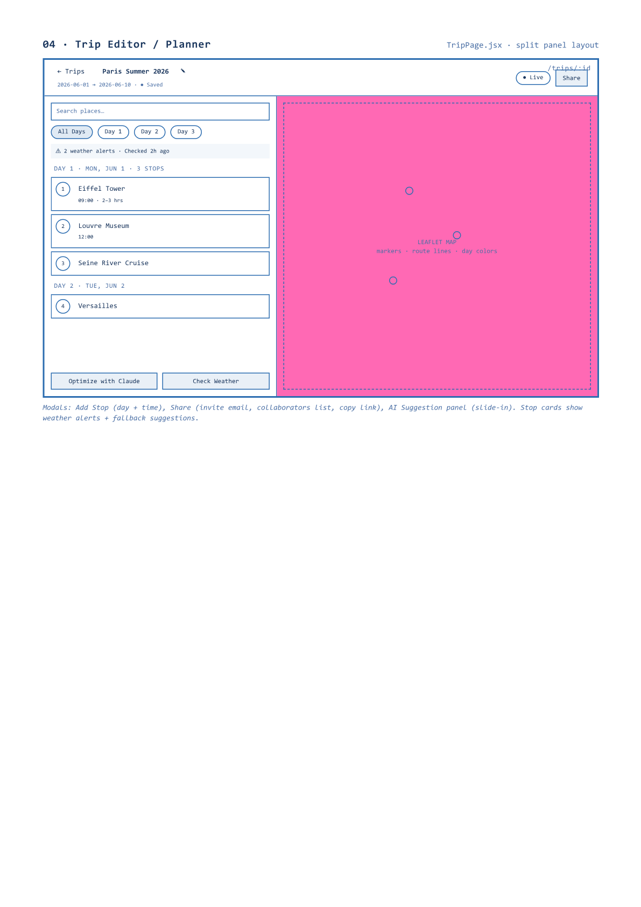
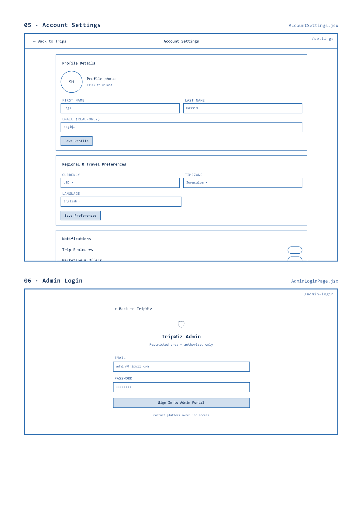
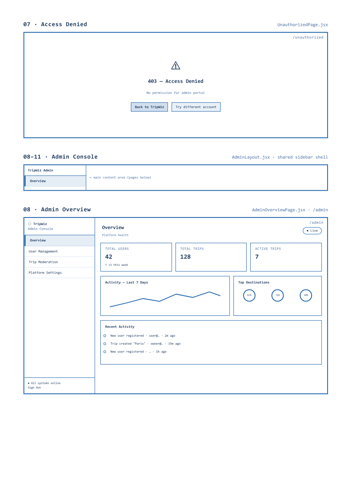
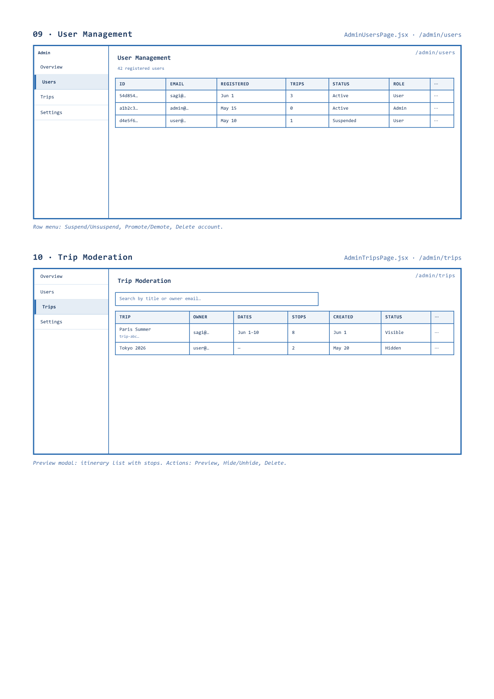
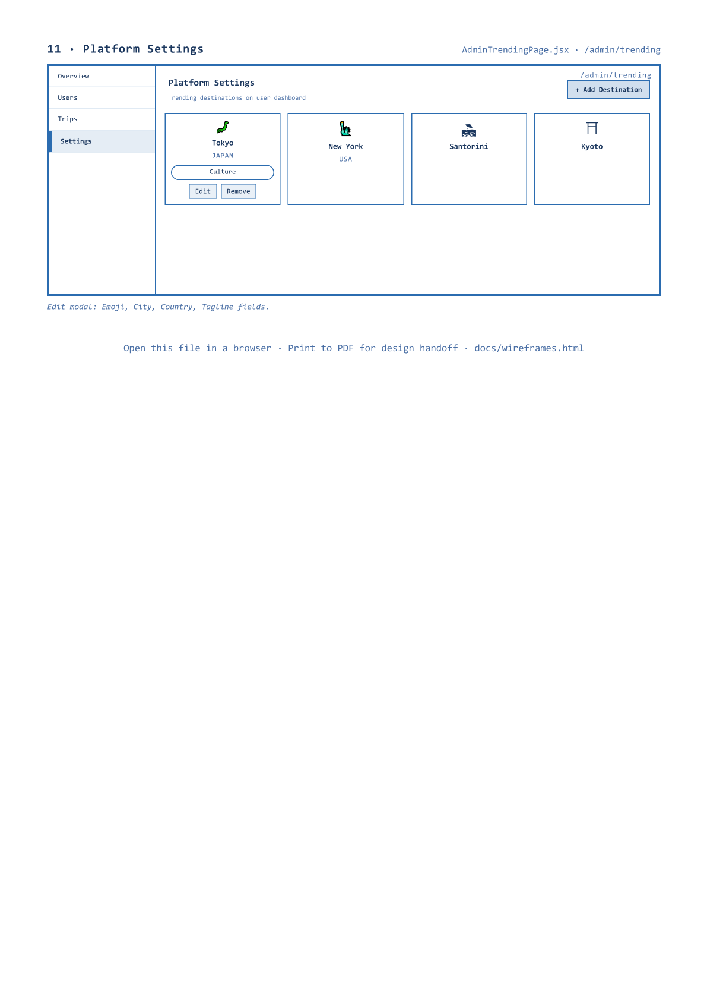

# TripWiz — Folder 04: UI Blueprint Sketches

**Team:** TripWiz — Ariel University · David Kitinberg, Amit Bitton, Sagi Hassid

---

Full-page wireframe layouts from `TripWiz-UI-sketch.pdf` (7 pages). Each page may include multiple screens.

## Page 1 — Home / Landing

## Page 2 — Auth · My Trips Dashboard

## Page 3 — Trip Editor / Planner

## Page 4 — Account Settings · Admin Login

## Page 5 — Access Denied · Admin Console · Overview

## Page 6 — User Management · Trip Moderation

## Page 7 — Platform Settings

