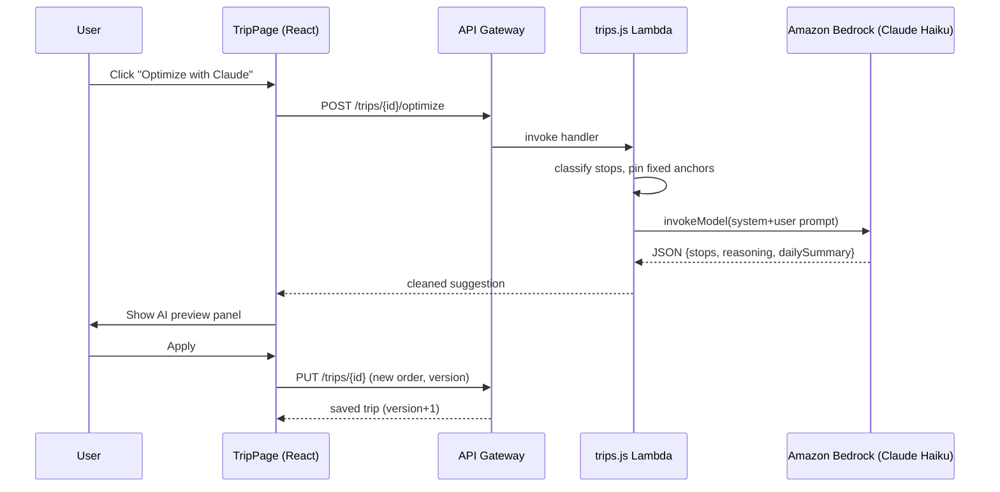
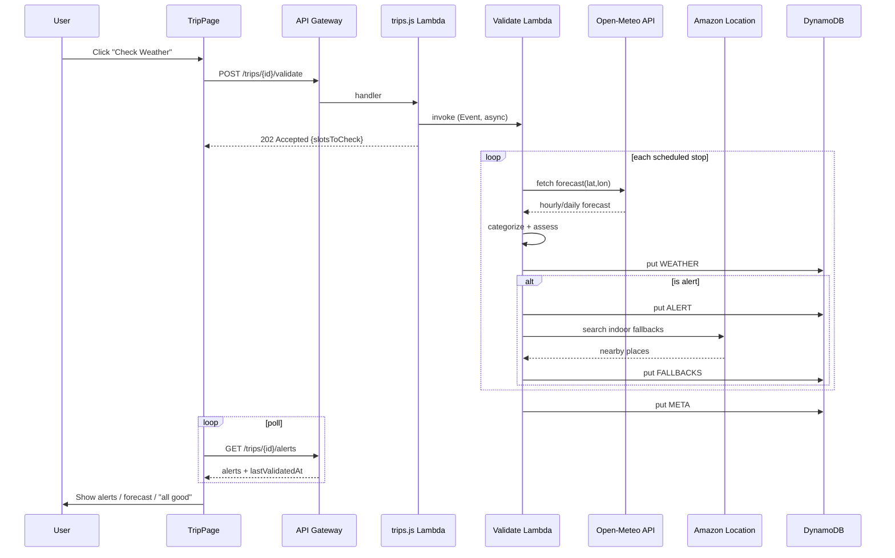
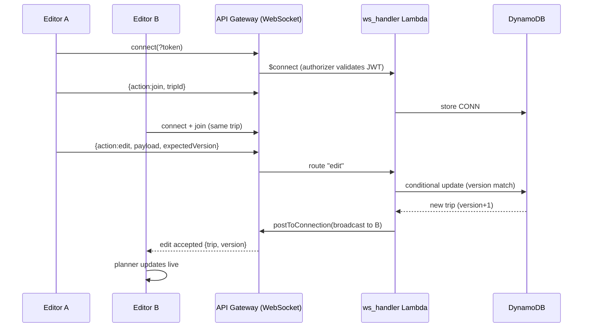
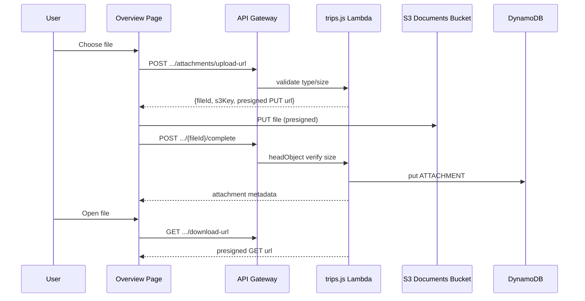

# TripWiz — Folder 05: Features & Use Cases

**Team:** TripWiz — Ariel University · David Kitinberg, Amit Bitton, Sagi Hassid

---

## How to read this document

This is the **complete** list of features and use cases present in the final TripWiz
product — not only the five "Key Features" outlined in the original proposal
([01.md](../01/01.md)), but every capability that was actually built.

* Each feature has a **stable number** (`Feature #1` … `Feature #50`).
* Each feature is described as a short **Story / scenario** (what actually happens
  when the feature is used), followed by **Implemented in** (the source files that
  realize it).
* In the source code, the lines that implement a feature are marked with a comment
  of the form `// [Feature #N] …` (JS/JSX) so any reviewer can jump from this list
  straight to the code.
* For the most involved multi-service flows, a **UML sequence diagram** (Mermaid) is
  included to complement the textual story.

Numbering is grouped by area for readability, but the numbers themselves are global
and never reused.

### Traceability to the original proposal

| Proposal "Key Feature" (01.md)        | Realized by features |
|---------------------------------------|----------------------|
| Visual Itinerary Builder              | #15, #16, #17, #18, #21 |
| Real-Time Collaborative Editing       | #26, #27, #28, #29, #30 |
| Smart Validation (Weather & Time)     | #21, #22, #23, #25, #40, #41 |
| Dynamic Routing & Mapping             | #19, #20 |
| Smart Fallback Recommendations        | #24 |

Everything else below (#1–#14, #31–#39, #42–#50) are features that were added during
development and are part of the final product.

---

## A. Authentication & Account Management

### Feature #1 — User Sign-Up with email verification
**Story:** A new visitor clicks "Create Free Account", enters an email and a password
(min 8 chars, upper/lower/number). The app registers the user in Amazon Cognito, which
emails a 6-digit verification code. The user is moved to the "Verify Your Email" step.
**Implemented in:** [frontend/src/services/auth.js](frontend/src/services/auth.js) `signUp()`; [frontend/src/pages/LoginPage.jsx](frontend/src/pages/LoginPage.jsx) `handleSignUp()`.

### Feature #2 — Email confirmation code + auto sign-in
**Story:** The user types the 6-digit code. On success the account is confirmed and, if
the password is still in memory, the app signs them in automatically and routes them
into the product; otherwise it returns them to the sign-in form.
**Implemented in:** [frontend/src/services/auth.js](frontend/src/services/auth.js) `confirmSignUp()`; [frontend/src/pages/LoginPage.jsx](frontend/src/pages/LoginPage.jsx) `handleConfirm()`.

### Feature #3 — User Sign-In (Cognito SRP)
**Story:** A returning user enters their credentials. Authentication uses Cognito's
SRP flow (the password never crosses the wire in plaintext). Friendly errors are shown
for wrong password, unknown account, or unverified email (which redirects to confirm).
**Implemented in:** [frontend/src/services/auth.js](frontend/src/services/auth.js) `signIn()`; [frontend/src/pages/LoginPage.jsx](frontend/src/pages/LoginPage.jsx) `handleSignIn()`.

### Feature #4 — Protected routes & session handling
**Story:** Pages such as `/trips`, `/settings`, and the trip editor require a valid
session. A guard checks the Cognito session before rendering and redirects to `/login`
if absent. The JWT ID token is attached to every API request.
**Implemented in:** [frontend/src/App.jsx](frontend/src/App.jsx) `PrivateRoute`; [frontend/src/services/auth.js](frontend/src/services/auth.js) `getSession()/isAuthenticated()/getIdToken()`; [frontend/src/services/api.js](frontend/src/services/api.js) `request()`.

### Feature #5 — Profile details (name + avatar)
**Story:** In Account Settings a user sets their first/last name and uploads a profile
photo. The name is persisted both to `localStorage` and to DynamoDB (so the reminder
emails can greet them by name); the avatar is stored locally as a base64 data URL.
**Implemented in:** [frontend/src/pages/AccountSettings.jsx](frontend/src/pages/AccountSettings.jsx) `saveProfile()/handleAvatarFile()`; backend `PUT /user/prefs` in [backend/src/rest_handlers/trips.js](backend/src/rest_handlers/trips.js).

### Feature #6 — Regional & travel preferences
**Story:** The user picks a default currency, timezone, and display language. These are
saved as defaults applied across their trips, persisted to DynamoDB user-prefs.
**Implemented in:** [frontend/src/pages/AccountSettings.jsx](frontend/src/pages/AccountSettings.jsx) `savePreferences()`; backend `PUT /user/prefs`.

### Feature #7 — Notification preferences (synced to backend)
**Story:** The user toggles "Upcoming Trip Reminders" and "Marketing & Offers". The
toggle writes immediately to DynamoDB, where the reminder Lambda later reads
`notifyTrips` to decide whether to email that user. Every account starts opted in:
a Cognito post-confirmation trigger seeds a default `PREFS` record with
`notifyTrips: true` the moment a new user verifies their email, so reminders work
out of the box without a trip to Settings first.
**Implemented in:** [frontend/src/pages/AccountSettings.jsx](frontend/src/pages/AccountSettings.jsx) `toggleNotif()`; backend `GET/PUT /user/prefs`; [backend/src/post_confirmation/index.js](backend/src/post_confirmation/index.js) `handler` (default-prefs seeding on sign-up).

### Feature #8 — Account deletion (self-service)
**Story:** In the "Danger Zone" the user types `delete` to confirm, which signs them out
and returns them to the home page.
**Implemented in:** [frontend/src/pages/AccountSettings.jsx](frontend/src/pages/AccountSettings.jsx) `handleDeleteAccount()`.

---

## B. Trip Management (Dashboard)

### Feature #9 — Create a trip
**Story:** From the home search bar or the "+ New Trip" modal, the user names a trip and
optionally sets start/end dates. The backend creates a versioned trip record owned by
the user and an owner access record, then opens the new trip.
**Implemented in:** [frontend/src/pages/TripsPage.jsx](frontend/src/pages/TripsPage.jsx) `createTrip()`; [frontend/src/pages/LoginPage.jsx](frontend/src/pages/LoginPage.jsx) `goAfterAuth()`; backend `POST /trips` + `writeAccessRecords()`.

### Feature #10 — "My Trips" dashboard
**Story:** The dashboard lists all of the user's non-deleted trips as cards with a
status badge (Draft / Upcoming / Active / Past), plus headline stats (total / upcoming /
completed).
**Implemented in:** [frontend/src/pages/TripsPage.jsx](frontend/src/pages/TripsPage.jsx) `TripsPage`/`getTripStatus()`; backend `GET /trips`.

### Feature #11 — Rename a trip
**Story:** From a card's "⋯" menu the user renames a trip inline; the new title saves via
an optimistic update.
**Implemented in:** [frontend/src/pages/TripsPage.jsx](frontend/src/pages/TripsPage.jsx) `submitRename()`; backend `PUT /trips/{tripId}`.

### Feature #12 — Trip cover image (custom + auto)
**Story:** Each card shows a representative photo: by default fetched from Wikipedia
based on the trip title, or a custom image the user drag-drops (kept in `localStorage`).
**Implemented in:** [frontend/src/pages/TripsPage.jsx](frontend/src/pages/TripsPage.jsx) `ImageDropZone`/`handleImageFile()`/`fetchWikiImage()`.

### Feature #13 — Delete a trip (soft delete)
**Story:** The user deletes a trip from the card menu after a confirm dialog. The backend
performs a soft delete (`deleted: true`) so the record can be audited/recovered.
**Implemented in:** [frontend/src/pages/TripsPage.jsx](frontend/src/pages/TripsPage.jsx) `deleteTrip()`; backend `DELETE /trips/{tripId}`.

### Feature #14 — Trending destinations inspiration
**Story:** The dashboard shows a "Where to Next?" grid of trending destinations
(configured by admins, with a built-in fallback). Clicking one pre-fills the create-trip
modal.
**Implemented in:** [frontend/src/pages/TripsPage.jsx](frontend/src/pages/TripsPage.jsx) trending `useEffect`; backend `GET /trending`.

---

## C. Itinerary Planner (the visual builder)

### Feature #15 — Add a stop via place autocomplete (day + time)
**Story:** In the planner the user types a place; an OpenStreetMap/Nominatim autocomplete
(Hebrew-aware) suggests landmarks with icons and country flags. Selecting one opens a
small modal to choose the day and an optional time, then adds the stop.
**Implemented in:** [frontend/src/pages/TripPage.jsx](frontend/src/pages/TripPage.jsx) `LocationAutocomplete`/`searchNominatim()`/`handleLocationSelect()`/`confirmAddStop()`.

### Feature #16 — Day-by-day organization & filtering
**Story:** Stops are grouped by day and globally numbered. Day-filter tabs let the user
focus on a single day or view all; each day is color-coded across the sidebar and the
map.
**Implemented in:** [frontend/src/pages/TripPage.jsx](frontend/src/pages/TripPage.jsx) day-tabs + `dayGroups`/`getTotalDays()`/`formatDayLabel()`.

### Feature #17 — Edit / remove a stop
**Story:** On any stop card the user can change its day (dropdown) or time (time input),
or remove it. Changes re-sort and re-number the itinerary.
**Implemented in:** [frontend/src/pages/TripPage.jsx](frontend/src/pages/TripPage.jsx) `StopCard` controls + `updateStop()`/`removeStop()`.

### Feature #18 — Auto-save with optimistic concurrency control
**Story:** Edits are debounced (~1.2 s) and saved automatically. Each save carries the
client's `version`; the backend increments it only if it matches, returning `409
VERSION_CONFLICT` otherwise so concurrent editors never silently overwrite each other.
A "Saving / Saved / Unsaved" indicator reflects status.
**Implemented in:** [frontend/src/pages/TripPage.jsx](frontend/src/pages/TripPage.jsx) `doSave()`/`scheduleSave()`; backend `PUT /trips/{tripId}` conditional update.

### Feature #19 — Interactive map with real road routing
**Story:** All geocoded stops are plotted on a Leaflet map with numbered, day-colored
markers. For each day the backend computes the real driving route geometry via Amazon
Location Service; if unavailable, the map falls back to dashed straight lines. The map
auto-fits to the stops.
**Implemented in:** [frontend/src/components/TripMap.jsx](frontend/src/components/TripMap.jsx); [frontend/src/pages/TripPage.jsx](frontend/src/pages/TripPage.jsx) route `useEffect`; backend `POST /routes/calculate` + `calculateRoute()`.

### Feature #20 — AI route optimization (Amazon Bedrock / Claude Haiku)
**Story:** The user clicks "Optimize with Claude". The backend sends the itinerary to
Claude Haiku 4.5 via Bedrock, which reorders attraction stops to minimize travel while
keeping flights/transit anchored to their exact day & time. The frontend shows a preview
panel (reasoning, day-by-day plan, estimated travel savings) that the user can Apply or
Dismiss; applying saves immediately.
**Implemented in:** [frontend/src/pages/TripPage.jsx](frontend/src/pages/TripPage.jsx) `handleOptimize()`/`AiSuggestionPanel`/`applyRouteSuggestion()`; backend `POST /trips/{tripId}/optimize` + `optimizeWithBedrock()`.

### Feature #21 — Per-stop duration estimation
**Story:** When a place is added, TripWiz estimates a sensible visit duration from its
category (e.g. museum 2–3 h, beach 2–4 h, hotel 0 h), shown on the stop card and used as
a planning hint by the optimizer.
**Implemented in:** [frontend/src/pages/TripPage.jsx](frontend/src/pages/TripPage.jsx) `estimateHours()`.

---

## D. Smart Weather Validation

### Feature #22 — On-demand weather check
**Story:** The user clicks "Check Weather". The frontend verifies there are stops with
coordinates and scheduled times, then triggers the validation Lambda asynchronously and
polls for results, showing live progress text.
**Implemented in:** [frontend/src/pages/TripPage.jsx](frontend/src/pages/TripPage.jsx) `handleValidate()`; backend `POST /trips/{tripId}/validate` (async `lambda.invoke`).

### Feature #23 — Context-aware weather assessment engine
**Story:** For each scheduled stop the validation Lambda fetches the Open-Meteo forecast
nearest the stop's time, categorizes the activity (SKI / BEACH / INDOOR / GENERAL
OUTDOOR), and applies category-specific thresholds (rain probability, wind, heat,
cold-for-beach, warm-with-no-snow-for-ski, storms) to decide if it's an alert.
**Implemented in:** [backend/src/validate_lambda/index.js](backend/src/validate_lambda/index.js) `getWeatherForSlot()`/`categorizeActivity()`/`assessWeather()`/`findForecastForTimestamp()`.

### Feature #23 results — Weather alerts & per-stop forecast display
**Story (continued):** After validation the planner shows a summary banner (N alerts vs
"looks good"), a per-stop weather badge (icon + temperature), and a warning block on any
flagged stop. *(Display side of Feature #23.)*
**Implemented in:** [frontend/src/pages/TripPage.jsx](frontend/src/pages/TripPage.jsx) alerts/`stopWeather` state + `StopCard`; backend `GET /trips/{id}/alerts`, `/weather`.

### Feature #24 — Smart fallback indoor recommendations
**Story:** When an outdoor stop is flagged, the Lambda queries Amazon Location Service for
nearby indoor options (museum, mall, cinema, aquarium, gallery) and stores them. In the
planner the user expands "View indoor alternatives" and can one-click **Replace** the
risky stop with a suggestion.
**Implemented in:** [backend/src/validate_lambda/index.js](backend/src/validate_lambda/index.js) `findFallbacks()`; [frontend/src/pages/TripPage.jsx](frontend/src/pages/TripPage.jsx) `StopCard` suggestions + `replaceStop()`; backend `GET /trips/{id}/fallbacks`.

### Feature #25 — Scheduled nightly validation
**Story:** Independently of any user action, an EventBridge schedule runs the validation
Lambda for trips starting soon, refreshing alerts/forecasts so plans stay current as the
trip approaches.
**Implemented in:** [backend/src/validate_lambda/index.js](backend/src/validate_lambda/index.js) `getScheduledTrips()`/`handler`; EventBridge rule in [backend/infra/template.yaml](backend/infra/template.yaml).

---

## E. Real-Time Collaboration

### Feature #26 — Invite a collaborator by email
**Story:** The trip owner opens "Share", enters an email of an existing TripWiz user, and
invites them. The backend looks the user up in Cognito and grants them editor access
(access record + a trip pointer in their partition + a collaborator info record).
**Implemented in:** [frontend/src/pages/TripPage.jsx](frontend/src/pages/TripPage.jsx) `handleInvite()`; backend `POST /trips/{tripId}/invite` + `lookupUserByEmail()`.

### Feature #27 — Manage collaborators (list / remove)
**Story:** The Share modal lists everyone with access. The owner can remove a
collaborator, which deletes their access + pointer + collaborator records.
**Implemented in:** [frontend/src/pages/TripPage.jsx](frontend/src/pages/TripPage.jsx) `openShareModal()`/`handleRemoveCollaborator()`; backend `GET /trips/{id}/collaborators`, `DELETE /trips/{id}/invite/{userId}`.

### Feature #28 — Share link & link-based viewer access
**Story:** The owner can copy the trip URL. Any authenticated TripWiz user who opens the
link gets read-only viewer access (resolved server-side via the trip's access records)
even without an explicit invite.
**Implemented in:** [frontend/src/pages/TripPage.jsx](frontend/src/pages/TripPage.jsx) `handleCopyLink()`; backend `resolveTripForUser()` link-sharing fallback.

### Feature #29 — Live real-time co-editing (WebSocket)
**Story:** Opening a trip connects to the WebSocket API and joins the trip "room". When
any editor saves, the change is broadcast to all other connected clients, whose planner
updates live (newer version wins; echoes of one's own save are ignored). Edits can flow
either through the REST save (which broadcasts) or directly over the socket.
**Implemented in:** [frontend/src/services/websocket.js](frontend/src/services/websocket.js); [frontend/src/pages/TripPage.jsx](frontend/src/pages/TripPage.jsx) `on('edit')`; [backend/src/ws_handler/index.js](backend/src/ws_handler/index.js) (`$connect`/join/edit/leave) + `broadcast()`; backend `broadcastTripUpdate()` in trips.js; [backend/src/ws_authorizer/index.js](backend/src/ws_authorizer/index.js).

### Feature #30 — Live presence / connection indicator
**Story:** The planner header shows a "Live / Offline" status driven by the WebSocket
connection state, plus a ping/pong heartbeat to keep the socket healthy.
**Implemented in:** [frontend/src/pages/TripPage.jsx](frontend/src/pages/TripPage.jsx) `wsConnected` + `on('connected'/'disconnected')`; [backend/src/ws_handler/index.js](backend/src/ws_handler/index.js) `ping`.

---

## F. Trip Overview Workspace

### Feature #31 — Reservations overview summary
**Story:** Opening a trip card lands on the Overview page — a scrollable dashboard with a
sticky section nav and a top "Reservations" summary (counts of stops, flights, stays,
cars, attachments).
**Implemented in:** [frontend/src/pages/TripOverviewPage.jsx](frontend/src/pages/TripOverviewPage.jsx) `buildOverviewRows()` + overview section + `IntersectionObserver` nav.

### Feature #32 — Flights manager (with airport autocomplete)
**Story:** The user adds flights with origin/destination, dates, times, airline, flight
number, terminals/gates, price, and status. Airport fields autocomplete against a bundled
6,000+ airport database (search by IATA/ICAO/city/country, English & Hebrew).
**Implemented in:** [frontend/src/pages/TripOverviewPage.jsx](frontend/src/pages/TripOverviewPage.jsx) `PlaceAutocompleteField`/`searchFlightSuggestions()`/`saveFlightFlight()`; [frontend/src/data/airports.json](frontend/src/data/airports.json).

### Feature #33 — Accommodation manager (auto-derived from itinerary)
**Story:** The user records stays (type, check-in/out, address, notes). TripWiz also
auto-derives likely accommodations from itinerary stops that look like hotels, so the
section is pre-populated.
**Implemented in:** [frontend/src/pages/TripOverviewPage.jsx](frontend/src/pages/TripOverviewPage.jsx) `deriveAccommodationsFromItinerary()`/`saveStayDraft()`/`classifyAccommodation()`.

### Feature #34 — Rental car manager
**Story:** The user records rental cars with pickup/return location, date, time, company,
car type, confirmation number, and price.
**Implemented in:** [frontend/src/pages/TripOverviewPage.jsx](frontend/src/pages/TripOverviewPage.jsx) `defaultRentalCar()`/`saveRentalCarDraft()`/`updateRentalCars()`.

### Feature #35 — Trip document attachments (S3)
**Story:** The user uploads booking PDFs/images (≤10 MB, PDF/PNG/JPG/WEBP/DOCX), optionally
tied to a specific flight/stay/car. Uploads use a presigned S3 PUT URL; the backend
verifies the object before recording metadata. Files can be opened (presigned GET) or
deleted.
**Implemented in:** [frontend/src/pages/TripOverviewPage.jsx](frontend/src/pages/TripOverviewPage.jsx) `uploadAttachment()`/`openAttachment()`/`deleteAttachment()`; [frontend/src/services/api.js](frontend/src/services/api.js) `uploadToSignedUrl`; backend attachment endpoints (`upload-url`, `complete`, `download-url`, delete).

### Feature #36 — Notes (trip-level + per-stop)
**Story:** The user writes free-text notes for the whole trip and per individual stop;
notes persist inside the trip metadata.
**Implemented in:** [frontend/src/pages/TripOverviewPage.jsx](frontend/src/pages/TripOverviewPage.jsx) `saveGeneralNotes()`/`updateStopNotes()`.

### Feature #37 — Packing list
**Story:** The user manages a categorized packing checklist (Clothes, Toiletries, etc.),
adding categories and items and ticking them off; state persists in trip metadata.
**Implemented in:** [frontend/src/pages/TripOverviewPage.jsx](frontend/src/pages/TripOverviewPage.jsx) `normalizePackingCategories()`/`updatePackingCategories()`.

### Feature #38 — Export to PDF / Excel
**Story:** From the Export section the user selects which sections to include and exports
the whole trip as a styled multi-section PDF (jsPDF + autoTable) or a multi-sheet Excel
workbook (XLSX).
**Implemented in:** [frontend/src/pages/TripOverviewPage.jsx](frontend/src/pages/TripOverviewPage.jsx) `runExport()`/`exportPdf()`/`exportExcel()`/`ExportModal`.

### Feature #39 — Destination hero imagery
**Story:** The Overview page shows a rotating hero image carousel built from the trip's
custom cover image and Wikipedia photos of the destination/top stops.
**Implemented in:** [frontend/src/pages/TripOverviewPage.jsx](frontend/src/pages/TripOverviewPage.jsx) `loadHeroImages()`/`fetchWikiThumbnail()`/`buildHeroSearchTerms()`.

---

## G. Asynchronous Notifications (backend)

### Feature #40 — Daily trip reminder emails
**Story:** A daily EventBridge cron runs the reminder Lambda, which finds trips starting
within N days, respects each owner's `notifyTrips` preference, and sends a branded HTML
email (with itinerary and any active weather alerts) via Amazon SES.
**Implemented in:** [backend/src/trip_reminder/index.js](backend/src/trip_reminder/index.js) `handler`/`getUpcomingTrips()`/`buildEmailHtml()`; gated on a `PREFS` record that [backend/src/post_confirmation/index.js](backend/src/post_confirmation/index.js) seeds with `notifyTrips: true` for every user at sign-up.

### Feature #41 — Weather alert emails (SNS → SES)
**Story:** When validation fires an alert it publishes to an SNS topic; a subscriber
Lambda converts the message into an email and sends it via SES.
**Implemented in:** [backend/src/validate_lambda/index.js](backend/src/validate_lambda/index.js) `sns.publish(...)`; [backend/src/sns_to_ses/index.js](backend/src/sns_to_ses/index.js) `handler`.

---

## H. Admin Portal

### Feature #42 — Admin authentication & access control
**Story:** Admins sign in at `/admin-login`. Access is granted to members of the Cognito
`Admins` group **or** a bootstrap email whitelist. A route guard protects all `/admin`
pages (redirecting non-admins to a 403 page), and every admin API re-checks authorization
server-side.
**Implemented in:** [frontend/src/pages/AdminLoginPage.jsx](frontend/src/pages/AdminLoginPage.jsx); [frontend/src/services/admin.js](frontend/src/services/admin.js) `isCurrentUserAdmin()`; [frontend/src/components/AdminRoute.jsx](frontend/src/components/AdminRoute.jsx); [frontend/src/pages/UnauthorizedPage.jsx](frontend/src/pages/UnauthorizedPage.jsx); backend `requireAdmin()`/`isAdminEvent()`.

### Feature #43 — Admin metrics & analytics dashboard
**Story:** The admin Overview shows total users, total trips, and active trips, a 7-day
activity area chart, top-destination ring charts, and a live activity feed of recent
registrations and trip creations.
**Implemented in:** [frontend/src/pages/AdminOverviewPage.jsx](frontend/src/pages/AdminOverviewPage.jsx); backend `GET /admin/metrics`.

### Feature #44 — Admin: suspend / unsuspend users
**Story:** From User Management the admin disables or re-enables a user's Cognito account.
**Implemented in:** [frontend/src/pages/AdminUsersPage.jsx](frontend/src/pages/AdminUsersPage.jsx) `handleSuspend()`; backend `POST /admin/users/{id}/suspend|unsuspend`.

### Feature #45 — Admin: promote / demote admins
**Story:** The admin adds/removes a user from the `Admins` group, with a guard preventing
removal of the last remaining admin.
**Implemented in:** [frontend/src/pages/AdminUsersPage.jsx](frontend/src/pages/AdminUsersPage.jsx) `handlePromoteDemote()`; backend `POST /admin/users/{id}/promote|demote`.

### Feature #46 — Admin: delete user account & purge data
**Story:** The admin permanently deletes a user after confirmation: their entire DynamoDB
`USER#` partition is purged and the Cognito user removed.
**Implemented in:** [frontend/src/pages/AdminUsersPage.jsx](frontend/src/pages/AdminUsersPage.jsx) `handleDelete()`; backend `DELETE /admin/users/{userId}`.

### Feature #47 — Admin: trip moderation (search & preview)
**Story:** The admin browses all platform trips, searches by title or owner email
(debounced), and previews any trip's itinerary in a modal.
**Implemented in:** [frontend/src/pages/AdminTripsPage.jsx](frontend/src/pages/AdminTripsPage.jsx) `load()`/`TripPreviewModal`; backend `GET /admin/trips`.

### Feature #48 — Admin: hide / unhide trips
**Story:** The admin flags a trip as hidden (or reveals it again) for moderation.
**Implemented in:** [frontend/src/pages/AdminTripsPage.jsx](frontend/src/pages/AdminTripsPage.jsx) `handleHide()`; backend `POST /admin/trips/{tripId}/hide`.

### Feature #49 — Admin: delete trips
**Story:** The admin removes an offending trip after confirmation (soft delete); the owner
no longer sees it.
**Implemented in:** [frontend/src/pages/AdminTripsPage.jsx](frontend/src/pages/AdminTripsPage.jsx) `handleDelete()`; backend `DELETE /admin/trips/{tripId}`.

### Feature #50 — Admin: manage trending destinations
**Story:** The admin curates the trending-destinations list (add/edit/remove city,
country, tag, emoji) shown on every user's dashboard (Feature #14).
**Implemented in:** [frontend/src/pages/AdminTrendingPage.jsx](frontend/src/pages/AdminTrendingPage.jsx); backend `PUT /admin/trending`.

---

## Feature index (quick reference)

| # | Feature | Primary file(s) |
|---|---------|-----------------|
| 1 | Sign-up + email verification | auth.js, LoginPage.jsx |
| 2 | Email confirmation + auto sign-in | auth.js, LoginPage.jsx |
| 3 | Sign-in (Cognito SRP) | auth.js, LoginPage.jsx |
| 4 | Protected routes & session | App.jsx, auth.js, api.js |
| 5 | Profile details (name + avatar) | AccountSettings.jsx, trips.js |
| 6 | Regional preferences | AccountSettings.jsx, trips.js |
| 7 | Notification preferences | AccountSettings.jsx, trips.js |
| 8 | Account deletion | AccountSettings.jsx |
| 9 | Create trip | TripsPage.jsx, LoginPage.jsx, trips.js |
| 10 | My Trips dashboard | TripsPage.jsx, trips.js |
| 11 | Rename trip | TripsPage.jsx, trips.js |
| 12 | Trip cover image | TripsPage.jsx |
| 13 | Delete trip (soft) | TripsPage.jsx, trips.js |
| 14 | Trending inspiration | TripsPage.jsx, trips.js |
| 15 | Add stop (autocomplete + day/time) | TripPage.jsx |
| 16 | Day-by-day organization | TripPage.jsx |
| 17 | Edit/remove stop | TripPage.jsx |
| 18 | Auto-save + version control | TripPage.jsx, trips.js |
| 19 | Map + real road routing | TripMap.jsx, TripPage.jsx, trips.js |
| 20 | AI route optimization | TripPage.jsx, trips.js |
| 21 | Duration estimation | TripPage.jsx |
| 22 | On-demand weather check | TripPage.jsx, trips.js |
| 23 | Weather assessment engine + display | validate_lambda/index.js, TripPage.jsx |
| 24 | Fallback indoor recommendations | validate_lambda/index.js, TripPage.jsx |
| 25 | Scheduled nightly validation | validate_lambda/index.js, template.yaml |
| 26 | Invite collaborator | TripPage.jsx, trips.js |
| 27 | Manage collaborators | TripPage.jsx, trips.js |
| 28 | Share link & viewer access | TripPage.jsx, trips.js |
| 29 | Live co-editing (WebSocket) | websocket.js, ws_handler, ws_authorizer, trips.js |
| 30 | Presence indicator | TripPage.jsx, ws_handler |
| 31 | Reservations overview | TripOverviewPage.jsx |
| 32 | Flights manager | TripOverviewPage.jsx, airports.json |
| 33 | Accommodation manager | TripOverviewPage.jsx |
| 34 | Rental car manager | TripOverviewPage.jsx |
| 35 | Document attachments (S3) | TripOverviewPage.jsx, api.js, trips.js |
| 36 | Notes (trip + per-stop) | TripOverviewPage.jsx |
| 37 | Packing list | TripOverviewPage.jsx |
| 38 | Export PDF / Excel | TripOverviewPage.jsx |
| 39 | Hero imagery | TripOverviewPage.jsx |
| 40 | Trip reminder emails | trip_reminder/index.js |
| 41 | Weather alert emails | validate_lambda/index.js, sns_to_ses/index.js |
| 42 | Admin auth & access control | AdminLoginPage.jsx, admin.js, AdminRoute.jsx, UnauthorizedPage.jsx, trips.js |
| 43 | Admin metrics dashboard | AdminOverviewPage.jsx, trips.js |
| 44 | Admin suspend/unsuspend | AdminUsersPage.jsx, trips.js |
| 45 | Admin promote/demote | AdminUsersPage.jsx, trips.js |
| 46 | Admin delete user + purge | AdminUsersPage.jsx, trips.js |
| 47 | Admin trip moderation | AdminTripsPage.jsx, trips.js |
| 48 | Admin hide/unhide trip | AdminTripsPage.jsx, trips.js |
| 49 | Admin delete trip | AdminTripsPage.jsx, trips.js |
| 50 | Admin trending management | AdminTrendingPage.jsx, trips.js |
