# TripWiz — Folder 07: End-User Manual

**Team:** TripWiz — Ariel University · David Kitinberg, Amit Bitton, Sagi Hassid

---

## How to read this manual

This manual is for **TripWiz travelers** — everyday users who plan trips, build
itineraries, collaborate with travel partners, and manage their travel documents.

> **Looking for the Admin Manual?** Portal administrators who moderate users, oversee
> trips, and curate trending-destination content should refer to
> [`08.md`](../08/08.md) (Folder 08 — Admin Portal Manual), a completely separate, dedicated
> document covering the in-app Admin Portal.

Every section is written as a numbered, step-by-step walkthrough so that any user —
regardless of technical background — can follow along and operate the system
successfully. Wherever a screen, modal, or panel appears in the workflow, a placeholder
of the form `[INSERT SCREENSHOT: ...]` marks exactly where to capture and paste a
screenshot from the live UI before this manual is finalized for submission.

This manual covers everything a regular TripWiz user — whether planning solo or with
travel partners — needs to know to use the system from first sign-up to final export.

## 1. Getting Started

### 1.1 Creating an Account

1. Open TripWiz in your browser and click **Sign Up** on the login screen.
2. Enter your **email address**, choose a **password**, and fill in your basic profile
   details (first name, last name).
3. Click **Create Account**. TripWiz uses Amazon Cognito to securely register your
   credentials — your password is never stored or transmitted in plain text (the app
   uses Secure Remote Password (SRP) authentication).

   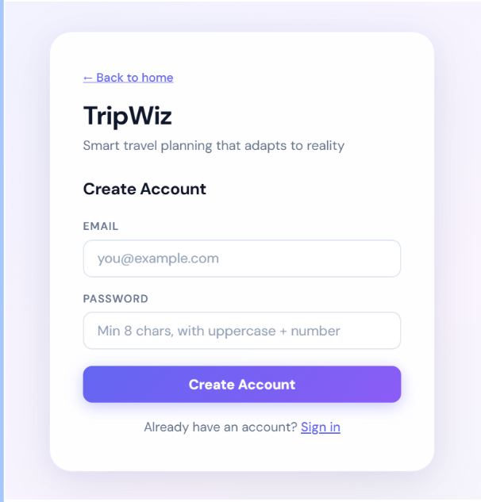

4. You will be redirected to a **confirmation screen**. Check your email inbox for a
   6-digit verification code sent by TripWiz.

   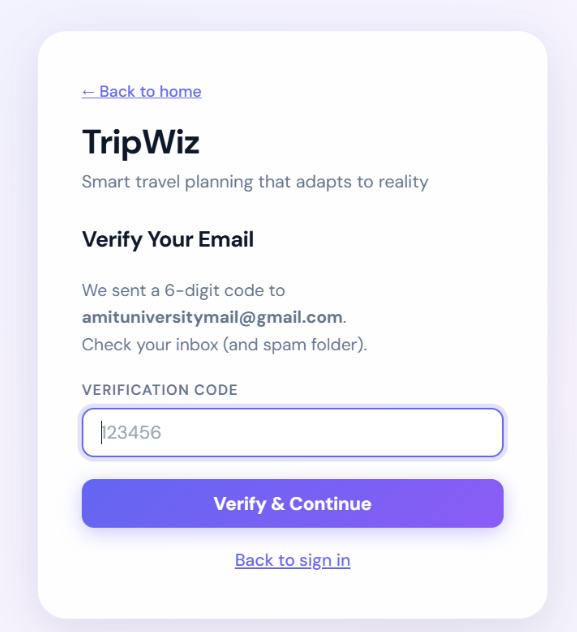

5. Enter the code on the confirmation screen and click **Confirm**.

6. Once confirmed, you'll be redirected to the sign-in page with a success message.

### 1.2 Signing In

1. On the login screen, enter your **email** and **password**.
2. Click **Sign In**.

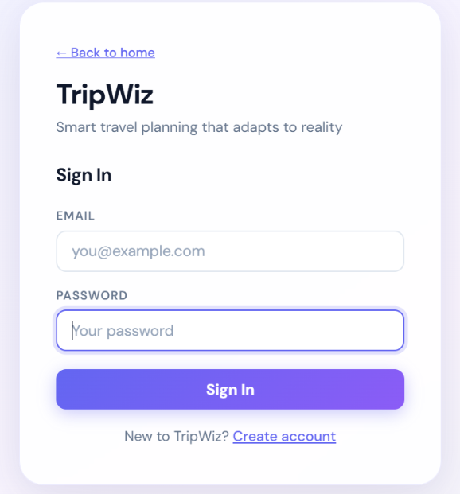

3. If your credentials are correct, you'll be taken directly to your **Trips Dashboard**.
4. If you forget your password or your account session expires, simply sign in again —
   TripWiz securely stores your session token and will keep you signed in across visits
   until you explicitly sign out.

> **Tip:** All pages in TripWiz other than the login and sign-up screens require you
> to be signed in. If you try to access a trip link while signed out, you'll be
> redirected to the login page first.

### 1.3 Managing Your Account Settings

1. Click your **profile icon / name** in the top navigation bar and select
   **Account Settings**.

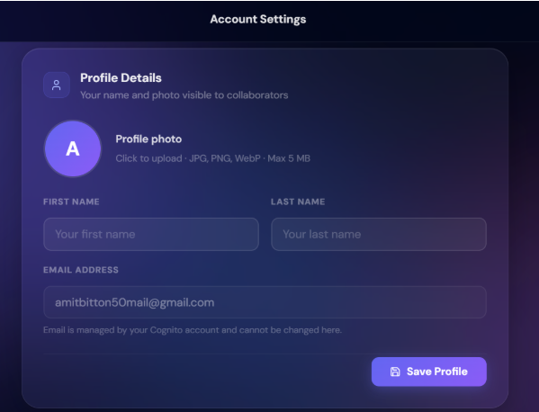

2. From this page you can:
   * **Edit your profile** — update your first name, last name, and other personal
     details, then click **Save Profile**.
   * **Set your travel preferences** — choose your preferred currency, units
     (metric/imperial), and travel style, then click **Save Preferences**.
   * **Toggle notification settings** — turn **trip reminder emails** and
     **weather alert emails** on or off using the switch controls. Changes are
     saved immediately.
   * **Delete your account** — scroll to the bottom of the page and click
     **Delete Account**. You will be asked to confirm this action because it is
     **permanent and cannot be undone**: all your trips, attachments, and
     collaborator invitations will be removed.

---

## 2. Managing Your Trips

### 2.1 The Trips Dashboard

1. After signing in, you land on your **Trips Dashboard** — a gallery of all the trips
   you own or have been invited to collaborate on.

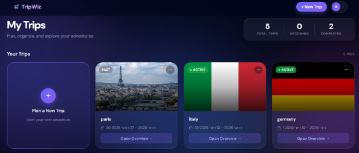

2. Each trip is shown as a card with a cover image (automatically fetched based on the
   destination), title, and date range.
3. Use the **search bar** at the top to filter your trips by name or destination.

### 2.2 Creating a New Trip

1. Click the **+ New Trip** button on the dashboard.

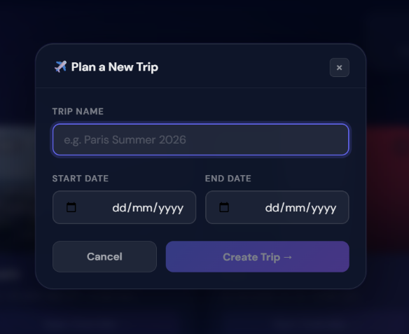

2. Enter a **trip title**, **start date**, and **end date**.
3. Optionally, drag-and-drop or browse to upload a **cover image** for your trip — or
   leave it blank and TripWiz will automatically fetch a relevant destination photo.
4. Click **Create**. You'll be taken directly into the new trip's **Itinerary Builder**
   (see Section 3) to begin planning.

### 2.3 Renaming or Deleting a Trip

1. From the dashboard, click the **⋮ (options)** icon on a trip card.
2. Select **Rename** to open a dialog where you can type a new title and click **Save**.
3. Select **Delete** to remove the trip. You'll be asked to confirm — deleted trips are
   moved to a recoverable "trash" state internally, but are no longer visible to you or
   your collaborators.

### 2.4 Discovering Trending Destinations

1. Scroll down on the Trips Dashboard to the **Trending Destinations** section.

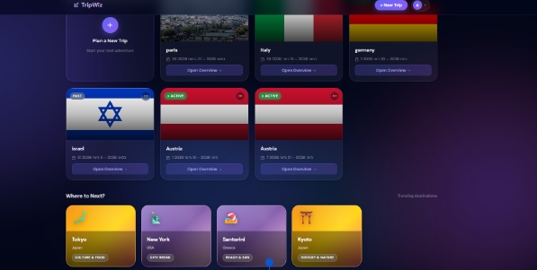

2. Browse curated destination suggestions (maintained by TripWiz administrators — see
   [`08.md`](../08/08.md), Section 5) for inspiration on where to plan your next trip.

---

## 3. Building Your Itinerary

This is the heart of TripWiz — the visual itinerary builder where you assemble your
day-by-day travel plan.

### 3.1 The Itinerary Builder Layout

1. Open any trip from your dashboard to land on the **Trip Page**.

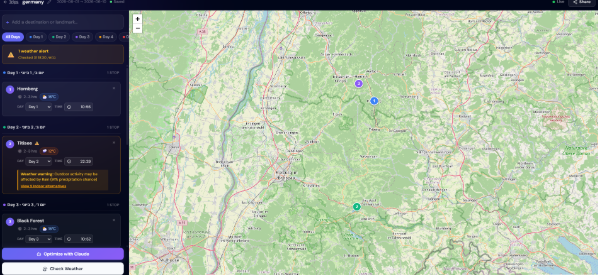

2. The page is split into:
   * A **day-by-day itinerary list** on the left/center, where stops are grouped and
     ordered by date and time.
   * An **interactive map** on the right, showing each stop as a pin and the calculated
     route connecting them.

### 3.2 Searching For and Adding a Stop

1. Click **+ Add Stop** within any day section.
2. Type the name of a place — a restaurant, hotel, attraction, airport, etc. — into the
   search box. TripWiz queries a live places database and shows matching results with
   addresses and map previews.

3. Click the desired result from the list.
4. Confirm or adjust the **date, start time**, and **estimated duration** for the stop,
   then click **Add to Itinerary**.
5. The stop now appears as a card in your day list and as a pin on the map.

### 3.3 Editing, Reordering, and Removing Stops

1. Each stop is shown as a **Stop Card** containing its name, time, location, and notes.

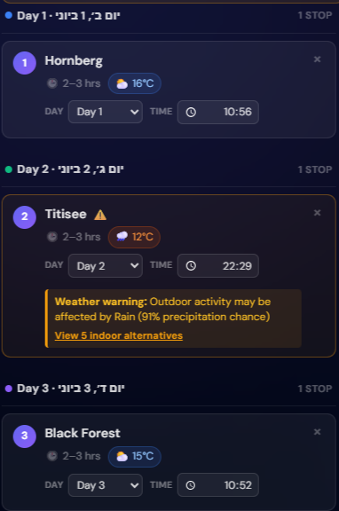

2. Click the **pencil/edit icon** on a stop card to change its title, time, duration,
   or notes. Click **Save** to apply your changes.
3. **Drag and drop** stop cards to reorder them within a day or move them between days
   — the itinerary, route, and map update automatically.
4. Click the **trash/remove icon** on a stop card to delete it from the itinerary. You
   may be asked to confirm.

### 3.4 Viewing Your Route on the Map

1. The map view automatically draws a **road-following route** connecting your stops in
   chronological order, calculated via Amazon Location Service.

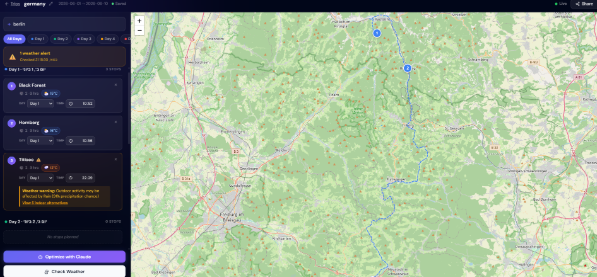

2. Click on any pin to see a popup with that stop's details.
3. The map updates live as you add, remove, or reorder stops.

### 3.5 Using AI Route Optimization

1. Click the **✨ Optimize with AI** button near the itinerary header.

2. TripWiz sends your current itinerary to an AI assistant (powered by Claude), which
   analyzes stop locations, timing, and travel distances, then suggests an improved
   order or schedule to minimize backtracking and wasted time.
3. Review the AI's suggested itinerary, shown side-by-side with your current plan
   (including a brief written explanation of what changed and why).
4. Click **Apply Suggestion** to adopt the AI's proposed order, or **Dismiss** to keep
   your current plan unchanged.

> **Tip:** You can run the optimizer multiple times as you add or change stops — it's
> designed for iterative refinement, not a one-shot "final answer."

---

## 4. Weather Validation & Smart Fallbacks

TripWiz checks your itinerary against real weather forecasts so you're never caught off
guard by rain on a beach day or snow on a hiking trip.

### 4.1 Running a Weather Validation

1. From the Trip Page, click the **Validate Weather** button.
2. TripWiz checks the forecast (up to 16 days ahead) for each stop's date, time, and
   location, and assesses whether the conditions are suitable for that type of activity
   (e.g., outdoor sightseeing vs. a museum visit vs. a ski trip).

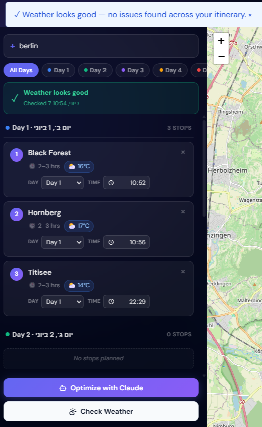

3. Any stop with a potential weather concern is flagged with an **alert badge** showing
   the predicted condition (e.g., "Heavy rain expected — 80% chance") directly on its
   stop card.
4. Validation also runs **automatically** in the background as your trip date
   approaches, and you'll be notified by email if new alerts appear (see Section 7).

### 4.2 Reviewing and Acting on Fallback Suggestions

1. Click on a flagged stop's **alert badge** to expand its details.

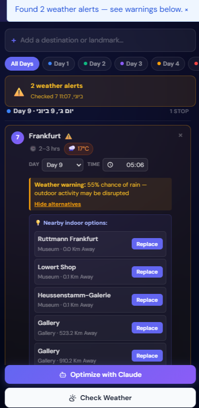

2. TripWiz suggests one or more **fallback alternatives** — for example, an indoor
   attraction near the same location if the original outdoor activity looks rained out.
3. Click **Replace Stop** to swap in the suggested fallback (your itinerary, map, and
   route update immediately), or **Keep Original** to dismiss the suggestion and keep
   your plan as-is.

---

## 5. Collaborating with Others

Plan trips together in real time with friends, family, or travel partners.

### 5.1 Inviting Collaborators

1. From the Trip Page, click the **Share** button (top-right).

   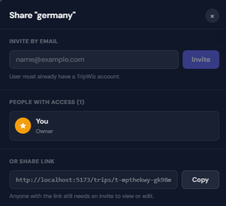

2. Enter the **email address** of the person you want to invite.
3. Choose their **role**:
   * **Editor** — can add, edit, reorder, and remove stops, and run validations/AI
     optimization.
   * **Viewer** — can see the itinerary and map but cannot make changes.
4. Click **Send Invite**. The invitee receives an email notification with a link to
   the trip.

### 5.2 Managing Collaborators

1. Open the **Share** modal again to see the **list of current collaborators** and
   their roles.

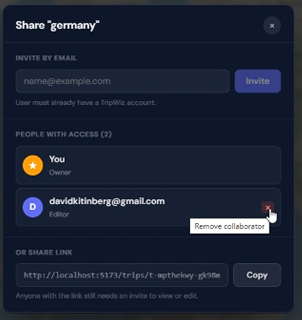
2. As the trip **owner**, you can click **Remove** next to any collaborator's name to
   revoke their access at any time.
3. Click **Copy Link** to copy a shareable trip URL to your clipboard — useful for
   sending the trip outside of email invitations (the recipient will still need an
   account and an active invitation to view or edit).

### 5.3 Live Co-Editing in Real Time

1. When you and a collaborator have the same trip open simultaneously, TripWiz
   establishes a **live connection** between your sessions.

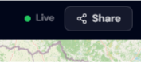

2. You'll see a small **presence indicator** (showing who else is currently viewing or
   editing the trip) and a **"connected" status badge**.
3. Any change one collaborator makes — adding a stop, editing a time, reordering the
   itinerary — appears **instantly** on every other connected collaborator's screen,
   without needing to refresh the page.
4. If two people try to edit conflicting information at the same moment, TripWiz
   safely resolves the conflict and notifies the user whose change could not be applied,
   so no one's edits are silently lost.

---

## 6. Trip Overview & Logistics

Beyond the day-by-day itinerary, TripWiz gives you one place to manage every other
aspect of your trip — flights, lodging, packing, documents, and exports.

### 6.1 Opening the Trip Overview

1. From the Trip Page, click **Trip Overview** in the navigation tabs.
2. This page consolidates all of your trip's logistics into organized sections,
   described below.

### 6.2 Managing Flights

1. In the **Flights** section, click **+ Add Flight**.

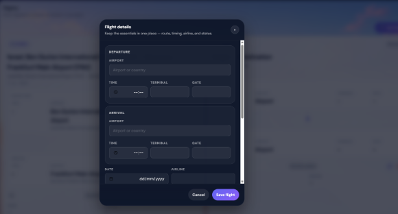

2. Start typing an airline or flight number — TripWiz suggests matches from a database
   of thousands of airports and routes.
3. Fill in departure/arrival airports, dates, and times, then click **Save Flight**.
4. Saved flights appear as cards with all key details (terminal, gate if known,
   duration) and are also reflected on your day-by-day itinerary automatically.

### 6.3 Managing Accommodations

1. In the **Stays** section, click **+ Add Accommodation**.

  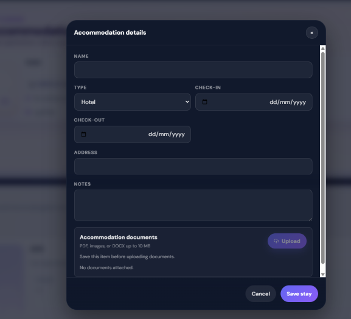

2. Enter the hotel/rental name, address, check-in/check-out dates, and any booking
   reference, then click **Save**.
3. TripWiz automatically derives suggested accommodation entries from hotel-type stops
   already in your itinerary — review and confirm these suggestions or add your own.

### 6.4 Managing Rental Cars

1. In the **Rental Car** section, click **+ Add Rental Car**.

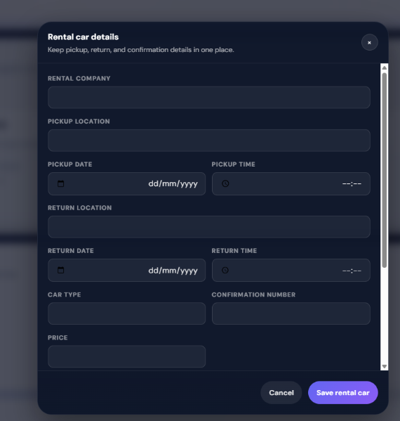

2. Enter the rental company, pickup/drop-off locations and times, and confirmation
   number, then click **Save**.

### 6.5 Notes and Packing Lists

1. Use the **General Notes** box to jot down trip-wide reminders (visa requirements,
   emergency contacts, budget notes, etc.) — your text is saved automatically as you type.
2. Each stop also has its own **note field**, accessible from its Stop Card, for
   location-specific reminders.
3. In the **Packing List** section, click **+ Add Category** (e.g., "Clothing",
   "Electronics") and then **+ Add Item** within each category.

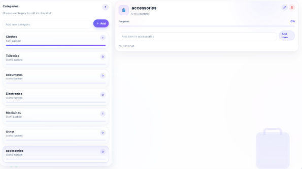

4. Check items off as you pack — your progress is saved automatically.

### 6.6 Uploading and Managing Document Attachments

1. In the **Documents** section, click **Upload File**.

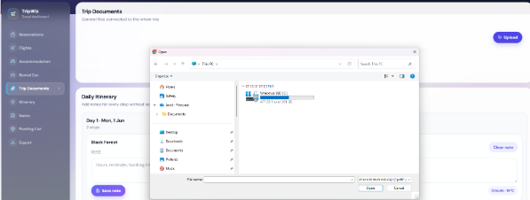

2. Select a file from your device (e.g., a flight ticket PDF, hotel voucher, or
   attraction pass image). TripWiz securely uploads it to encrypted cloud storage.
3. Once uploaded, the document appears in your attachments list with its name, size,
   and upload date.
4. Click **Download** on any attachment to retrieve it, or the **trash icon** to delete
   it permanently.

### 6.7 Exporting Your Trip

1. Click the **Export** button at the top of the Trip Overview page.

  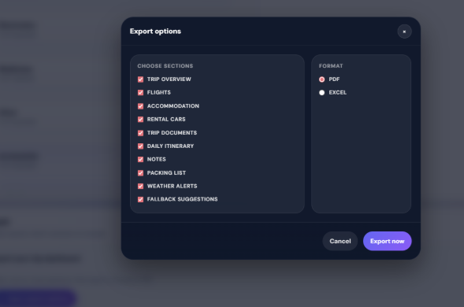

2. Choose your preferred format:
   * **Export as PDF** — generates a polished, printable itinerary document including
     your day-by-day plan, flights, stays, and notes.
   * **Export as Excel** — generates a structured spreadsheet of your itinerary and
     logistics, useful for further editing or sharing with non-TripWiz users.
3. The file downloads directly to your device.

---

## 7. Staying Informed — Notifications

TripWiz proactively keeps you informed about your upcoming trips via email (you can
control these from **Account Settings**, see Section 1.3).

### 7.1 Trip Reminder Emails

1. If you have **trip reminders enabled**, TripWiz automatically emails you a
   beautifully formatted summary a couple of days before any trip begins — including
   your itinerary highlights and any active weather alerts.

   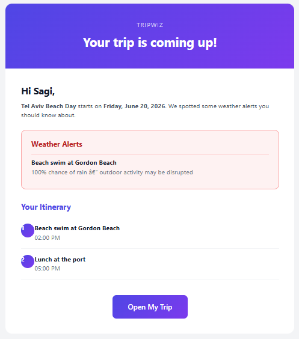

2. Click **Open My Trip** in the email to jump straight back into TripWiz.

### 7.2 Weather Alert Emails

1. If TripWiz detects a significant weather concern for an upcoming stop (see
   Section 4), and you have **weather alerts enabled**, you'll receive an email
   notification describing the concern and which stop it affects.

   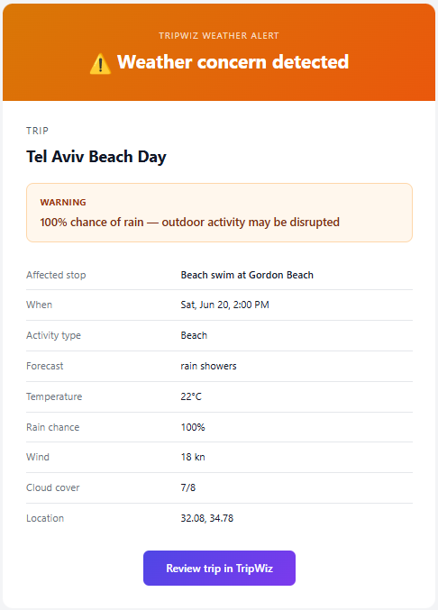

2. Use this as an early warning to revisit your itinerary and consider the suggested
   fallback alternatives before you depart.

---
