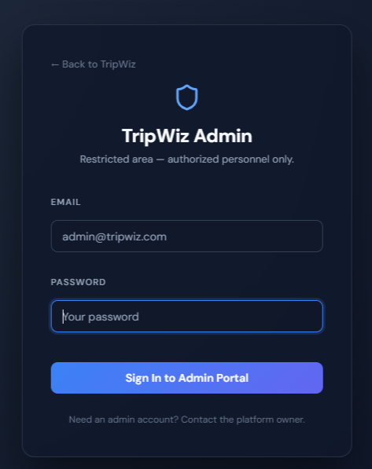
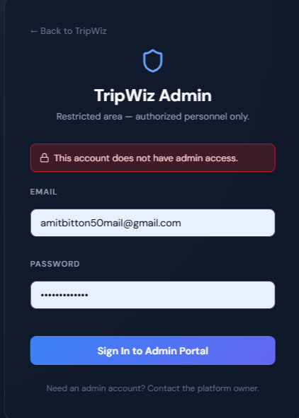
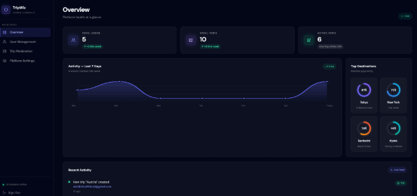
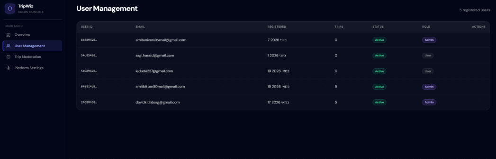
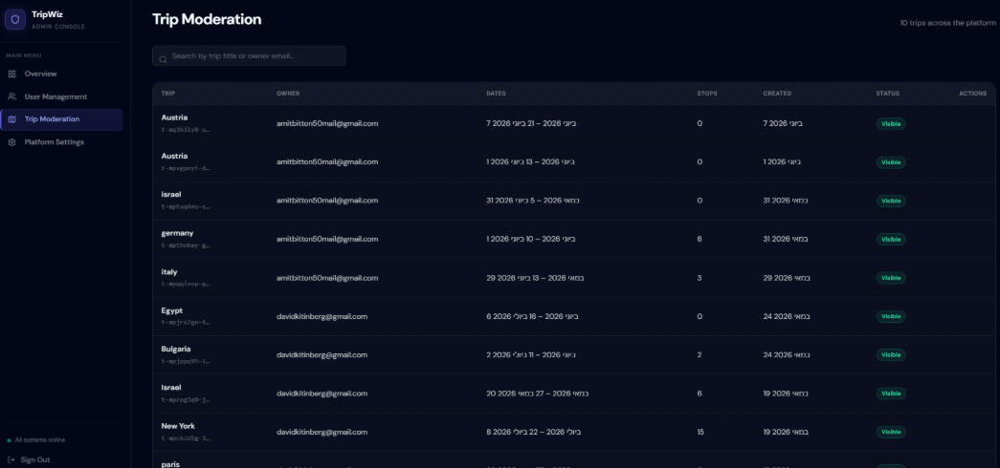
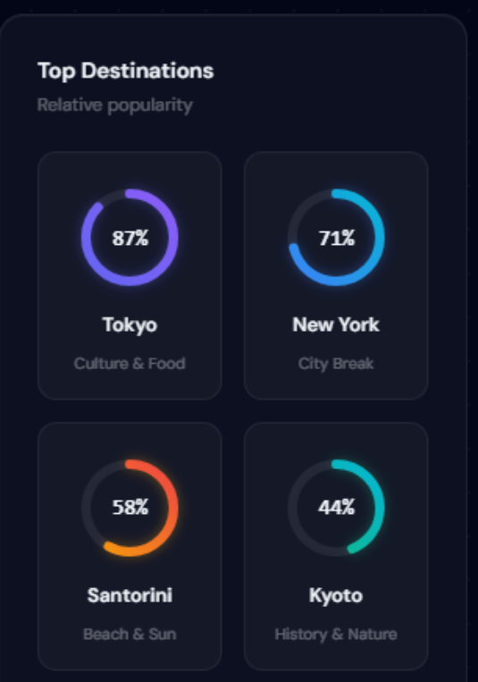

# TripWiz — Folder 08: Admin Portal Manual

**Team:** TripWiz — Ariel University · David Kitinberg, Amit Bitton, Sagi Hassid

---

## How to read this manual

This manual is for **TripWiz portal administrators** — a small group of trusted users
responsible for moderating the platform, supporting end-users, and curating content
through the **in-app Admin Portal**. Admin access is granted via a Cognito user-group
membership (and an initial email whitelist for bootstrap purposes), and using the
Admin Portal is **completely separate** from the regular traveler experience documented
in [`07.md`](07.md) (Folder 07 — End-User Manual).

Every section below is written as a numbered, step-by-step walkthrough so that any
authorized administrator — regardless of technical background — can follow along and
operate the portal successfully. Wherever a screen, modal, or panel appears in the
workflow, a screenshot from the live UI is embedded directly below the relevant step.

---

## 1. Accessing the Admin Portal

1. Navigate to the dedicated **Admin Login** page (a separate URL from the regular
   traveler login).

   

2. Sign in with your administrator credentials (the same Cognito account used for your
   regular TripWiz access, provided your account has been granted admin privileges).
3. TripWiz checks your account against the **Admins group** in Cognito (or the
   bootstrap email whitelist). If you are authorized, you're taken to the
   **Admin Dashboard**.
4. If your account is **not** authorized for admin access, you'll see an
   **Unauthorized** screen explaining that you do not have the required permissions.

   

> **Security note:** All admin actions are performed through dedicated, protected
> backend routes that independently verify your admin status on every request — admin
> privileges cannot be spoofed from the browser.

---

## 2. Dashboard & Metrics

1. The **Admin Overview** page is your landing page after logging in.

   

2. Here you can see at-a-glance **platform metrics**, such as the total number of
   registered users, active trips, and recent platform activity — useful for monitoring
   the health and growth of TripWiz.

---

## 3. Managing Users

1. Click **Users** in the admin navigation to open the **user management table**.

   

2. The table lists every registered user along with their email, registration date,
   account status, and role.
3. Use the **search/filter bar** to locate a specific user.
4. For any user, you can:
   * **Suspend** — temporarily disables the account; the user cannot sign in until
     reinstated. Click **Suspend**, confirm the action.
   * **Unsuspend** — restores a suspended account. Click **Unsuspend** on a suspended
     user's row.
   * **Promote to Admin** — grants the user administrator privileges by adding them
     to the Cognito Admins group. Click **Promote**, confirm the action.
   * **Demote from Admin** — revokes administrator privileges from a user. Click
     **Demote**, confirm the action.
   * **Delete Account** — permanently removes the user and their data from the
     platform. Click **Delete**, and confirm — **this action cannot be undone**.

---

## 4. Managing Trips

1. Click **Trips** in the admin navigation to open the **trip oversight table**.

   

2. The table lists every trip on the platform along with its title, owner, dates, and
   visibility status.
3. Use the **search/filter bar** to locate a specific trip (e.g., one that was reported
   for inappropriate content).
4. For any trip, you can:
   * **Hide** — removes the trip from public-facing surfaces (such as trending
     destinations or shared previews) without deleting it. Click **Hide** on the
     trip's row.
   * **Delete** — permanently removes the trip from the platform. Click **Delete**,
     and confirm — **this action cannot be undone** and will also remove the trip for
     any collaborators.

---

## 5. Managing Trending Destinations

1. Click **Trending** in the admin navigation to open the **trending destinations
   editor**.

   

2. Here you curate the list of destinations shown to all travelers on their dashboard
   (see [`07.md`](07.md), Section 2.4).
3. Click **+ Add Destination**, enter the destination name and an image, and click
   **Save** to add it to the rotation.
4. Click the **edit icon** on an existing entry to update its details, or the
   **trash icon** to remove it from the trending list.
5. Changes take effect immediately and are visible to all travelers the next time they
   load their dashboard.

---

