# TripWiz — Folder 11: System Administrator Manual

**Team:** TripWiz — Ariel University · David Kitinberg, Amit Bitton, Sagi Hassid

---

## How to read this manual

This is a **completely separate manual** from the End-User Manual (Folder 07) and the
Admin Portal Manual (Folder 08). Its sole audience is the **System Administrator** —
the technical operator responsible for deploying, configuring, monitoring, and
maintaining the TripWiz **AWS serverless infrastructure** itself.

> **This is not the in-app Admin Portal.** Folder 08 already documents the in-app
> Admin Portal (a TripWiz application feature used to moderate users, trips, and
> trending content through the TripWiz UI). *This* manual is for the person who keeps
> the underlying AWS stack running — deploying code, configuring services, rotating
> secrets, monitoring logs, and responding to infrastructure incidents. The two roles
> may be the same person on a small team, but the responsibilities and tools are
> entirely different.

Every section below is a numbered, step-by-step walkthrough referencing the actual
infrastructure declared in `backend/infra/template.yaml` (the AWS SAM template that
defines the entire TripWiz backend). Wherever the AWS Management Console is the
relevant tool, a placeholder of the form `[INSERT SCREENSHOT: ...]` marks exactly
where to capture and paste a console screenshot before this manual is finalized.

> **Note on supplementary materials:** As with the End-User Manual, any future video
> walkthroughs or in-app help content for administrators are **supplementary only**.
> Per the course guidelines, they do not replace this written manual, which remains
> the authoritative operations reference for the system.

---

## 1. Introduction & Prerequisites

### 1.1 Who Should Use This Manual

This manual is intended for a **technically proficient operator** — a DevOps engineer,
backend developer, or IT administrator — responsible for the AWS account hosting
TripWiz. Familiarity with AWS fundamentals (IAM, CloudFormation, Lambda) and basic
command-line usage is assumed.

### 1.2 Required AWS Account Access

1. You will need an **IAM user or role** with sufficient permissions to manage:
   CloudFormation/SAM stacks, Lambda, API Gateway, DynamoDB, Cognito, S3, Bedrock,
   Amazon Location Service, SES, SNS, EventBridge, Secrets Manager, and CloudWatch.
2. For initial setup and ongoing maintenance, **AdministratorAccess** (or an
   equivalently-scoped custom policy covering the services above) is recommended for
   the operator's IAM identity.

   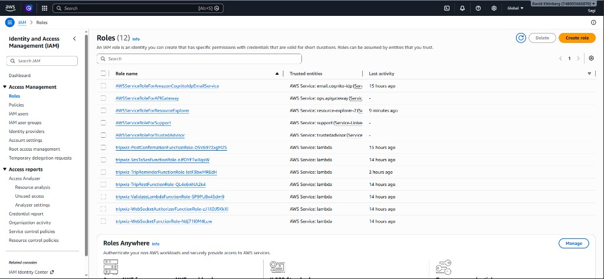

3. Confirm you can sign in to the **AWS Management Console** for the account hosting
   TripWiz, and note the **AWS region** the stack is deployed to (TripWiz is configured
   for `US East (N. Virginia)` — `us-east-1` — by default).

### 1.3 Required Local Tools

Install the following on your operator workstation before attempting any deployment
or maintenance task:

1. **AWS CLI v2** — for authenticating to AWS and running ad-hoc commands.
2. **AWS SAM CLI** — for building and deploying the serverless stack
   (`backend/infra/template.yaml` uses the `AWS::Serverless-2016-10-31` transform).
3. **Node.js 24.x** — matches the Lambda runtime (`nodejs24.x`) declared in the
   template's `Globals` section, ensuring local builds match the deployed environment.
4. **Git** — to pull the latest TripWiz source code from the repository.

Run `aws configure` to set up your CLI credentials and default region before proceeding.

### 1.4 Repository Layout — Where Things Live

| Path | Purpose |
|------|---------|
| `backend/infra/template.yaml` | The SAM template — the single source of truth for all AWS infrastructure |
| `backend/src/` | Lambda function source code (one subfolder per function) |
| `frontend/amplify.yml` | Build specification for the AWS Amplify-hosted frontend |
| `06.md` | The full AWS cost estimate for this architecture (cross-referenced in Section 10) |

---

## 2. Deploying & Updating the System

### 2.1 Building the Stack

1. Open a terminal and navigate to the `backend/infra/` directory.
2. Run:
   ```
   sam build
   ```
   This packages each Lambda function (from `CodeUri: ../src/`) and prepares the
   CloudFormation template for deployment.
3. Confirm the build completes without errors — any syntax issues in the Lambda
   source code will surface here before you attempt a deployment.

### 2.2 Deploying for the First Time

1. Run:
   ```
   sam deploy --guided
   ```
2. The guided deployment will prompt you for:
   * **Stack name** (e.g., `tripwiz-prod`)
   * **AWS Region** (e.g., `us-east-1`)
   * **Parameter values** — the template defines four parameters you must supply:

   | Parameter | Description | Example |
   |-----------|-------------|---------|
   | `AdminEmail` | Address that receives TripWiz alert emails (must be SES-verified) | `admin@yourdomain.com` |
   | `SourceEmail` | SES-verified sender address for outgoing TripWiz emails | `noreply@yourdomain.com` |
   | `AdminBootstrapEmails` | Comma-separated emails granted admin access before Cognito group sync | `admin@yourdomain.com` |
   | `ReminderDays` | Days before trip start to send reminder emails (default: `2`) | `2` |

   ```
   cd backend/infra
   sam build
   sam deploy

   Deploying with following values
   ===============================
   Stack name                   : tripwiz
   Region                       : us-east-1
   Parameter overrides          : {
     "AdminEmail": "amituniversitymail@gmail.com",
     "SourceEmail": "amituniversitymail@gmail.com",
     "AdminBootstrapEmails": "amituniversitymail@gmail.com,davidkitinberg@gmail.com",
     "FrontendUrl": "https://main.d1qe3fil02rb8e.amplifyapp.com"
   }

   No changes to deploy. Stack tripwiz is up to date
   ```

3. Confirm changes when prompted, and allow the deployment to proceed. SAM will create
   a CloudFormation **change set** and apply it.
4. Once complete, open the **AWS CloudFormation console** and locate your stack to
   review its **Outputs** tab — this lists critical values you'll need for frontend
   configuration and ongoing operations (REST API URL, WebSocket endpoint, Cognito
   User Pool ID and Client ID, DynamoDB table name, SNS topic ARN).

   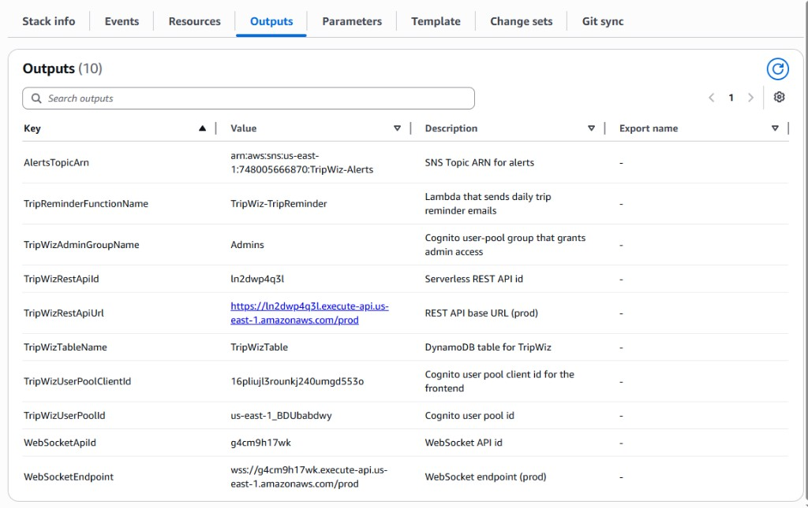

### 2.3 Deploying Updates

1. After pulling the latest code changes, repeat the build step:
   ```
   sam build
   ```
2. Deploy the update:
   ```
   sam deploy
   ```
   (Once a `samconfig.toml` exists from your first guided deployment, subsequent
   deploys reuse the saved configuration without re-prompting.)
3. Monitor the **CloudFormation console** to watch the stack transition through
   `UPDATE_IN_PROGRESS` to `UPDATE_COMPLETE`. If a deployment fails, CloudFormation
   automatically rolls back to the last known-good state — review the **Events** tab
   to diagnose the failure reason.

   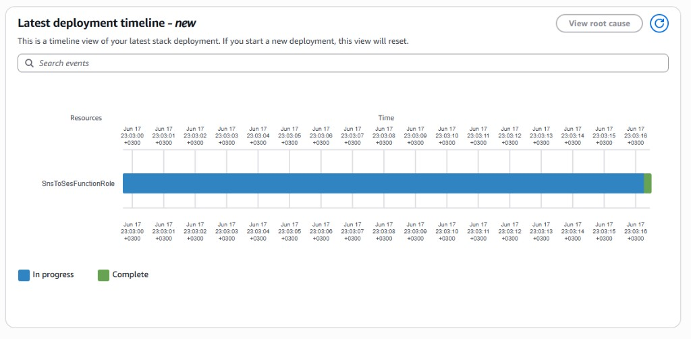

### 2.4 Required Post-Deployment Steps

The template provisions two **empty** Secrets Manager secrets that must be populated
manually after the first deploy (see Section 8 for details):

1. `TripWiz/OpenWeatherApiKey` — your OpenWeatherMap API key
2. `TripWiz/MappingApiKey` — your mapping service API key (if using a third-party
   provider alongside Amazon Location Service)

> **Important:** TripWiz will not function correctly until these secrets are populated.
> Do not skip Section 8 after your first deployment.

---

## 3. Managing Compute & APIs

### 3.1 The Seven Lambda Functions

TripWiz's entire backend runs on seven Lambda functions, all using the `nodejs24.x`
runtime. Open the **AWS Lambda console** and locate each by name:

| Function Name | Source Folder | Role |
|---------------|--------------|------|
| `TripWiz-Trips` | `rest_handlers/trips.js` | Main REST API handler — trips, places, admin routes, user prefs |
| `TripWiz-Validate` | `validate_lambda/index.js` | On-demand + nightly weather validation |
| `TripWiz-WebSocketHandler` | `ws_handler/index.js` | Real-time co-editing WebSocket router |
| `TripWiz-WebSocketAuthorizer` | `ws_authorizer/index.js` | JWT validation for WebSocket `$connect` |
| `TripWiz-TripReminder` | `trip_reminder/index.js` | Daily scheduled trip-reminder emails |
| `TripWiz-SnsToSes` | `sns_to_ses/index.js` | Converts SNS weather alerts into admin emails |
| `TripWiz-PostConfirmation` | `post_confirmation/index.js` | Cognito post-confirmation trigger — seeds default notification prefs (`notifyTrips: true`) for every newly confirmed user |

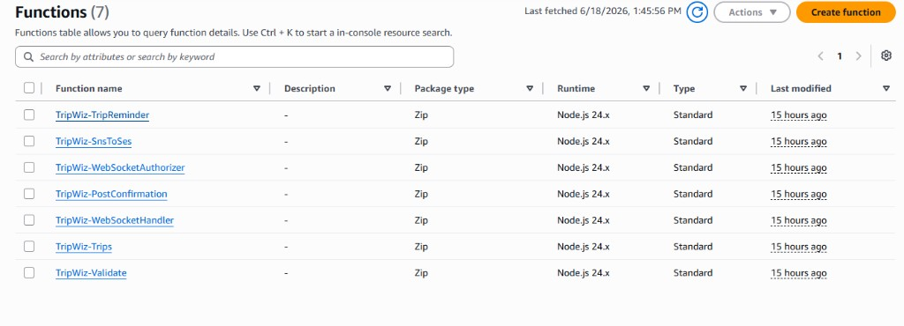

### 3.2 Inspecting and Adjusting a Function's Configuration

1. Click into any function (e.g., `TripWiz-Trips`) from the list.
2. On the **Configuration** tab:
   * **General configuration** — shows memory allocation and timeout. `TripWiz-Trips`
     and `TripWiz-TripReminder` are configured with a **60-second timeout** (they
     perform multiple downstream calls — DynamoDB, Bedrock, SES); all others use the
     **10-second** default declared in the template's `Globals` section.
   * **Environment variables** — shows the runtime configuration injected at deploy
     time (e.g., `TABLE_NAME`, `BEDROCK_MODEL_ID`, `WS_ENDPOINT`, `DOCUMENTS_BUCKET`).
     **Do not edit these manually** — they are managed by the SAM template and will be
     overwritten on the next deployment. To change a value permanently, edit
     `template.yaml` and redeploy.

   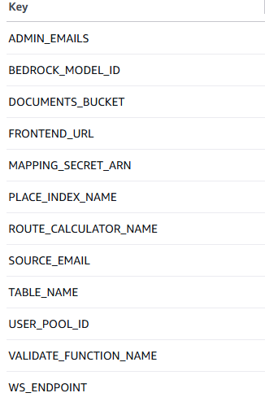

3. On the **Permissions** tab, review the function's **execution role** — this defines
   exactly which AWS resources the function can access (DynamoDB, S3, Bedrock,
   Secrets Manager, Cognito, Amazon Location Service, etc., as scoped in the
   template's `Policies` blocks). Never broaden these permissions outside of
   `template.yaml` — doing so creates configuration drift that will be silently
   reverted (or cause deployment conflicts) on the next deploy.

### 3.3 The REST API (API Gateway)

1. Open the **API Gateway console** and locate **`TripWizApi`**.
2. This REST API exposes **29 routes** (e.g., `GET /trips`, `POST /trips/{tripId}/optimize`,
   `GET /admin/users`) — all backed by the single `TripWiz-Trips` Lambda function via
   proxy integration.
3. Click **Stages → prod** to view the live deployment stage and its **Invoke URL**
   (this must match the `TripWizRestApiUrl` value shown in the CloudFormation Outputs).

   **TripWizApi REST routes** (`prod` stage — `https://ln2dwp4q3l.execute-api.us-east-1.amazonaws.com/prod`):

   ```
   /admin
     /metrics          GET, OPTIONS
     /trending         OPTIONS, PUT
     /trips            GET, OPTIONS
       /{tripId}       DELETE, OPTIONS
         /hide         OPTIONS, POST
     /users            GET, OPTIONS
       /{userId}       DELETE, OPTIONS
         /demote       OPTIONS, POST
         /promote      OPTIONS, POST
         /suspend      OPTIONS, POST
         /unsuspend    OPTIONS, POST

   /places
     /search           GET, OPTIONS

   /routes
     /calculate        OPTIONS, POST

   /trending           GET, OPTIONS

   /trips              GET, OPTIONS, POST
     /{tripId}         DELETE, GET, OPTIONS, PUT
       /alerts         GET, OPTIONS
       /attachments    GET, OPTIONS
         /{fileId}     DELETE, OPTIONS
       /complete       OPTIONS, POST
       /download-url   GET, OPTIONS
       /upload-url     OPTIONS, POST
       /collaborators  GET, OPTIONS
       /fallbacks      GET, OPTIONS
       /invite         OPTIONS, POST
         /{userId}     DELETE, OPTIONS
       /optimize       OPTIONS, POST
       /validate       OPTIONS, POST
       /weather        GET, OPTIONS

   /user
     /prefs            GET, OPTIONS, PUT
   ```

4. Under **Authorizers**, confirm `TripWizCognitoAuthorizer` is attached as the
   **default authorizer** — this enforces that every route (except CORS preflight
   `OPTIONS` requests) requires a valid Cognito JWT.
5. Under **Gateway Responses**, note the custom `DEFAULT_4XX`/`DEFAULT_5XX` responses
   that inject CORS headers — these exist so that browser clients receive proper CORS
   headers even on authorization failures and server errors. **Do not remove these.**

### 3.4 The WebSocket API

1. In the API Gateway console, locate **`TripWizWebSocketApi`** (Protocol type:
   **WebSocket**).
2. Review its **Routes**: `$connect`, `$disconnect`, `join`, `leave`, `edit`, `cursor`,
   and `ping` — each integrated with `TripWiz-WebSocketHandler` via Lambda proxy.

   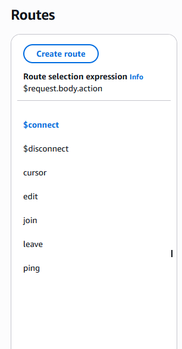

3. Note that `$connect` is the only route protected by a **custom REQUEST authorizer**
   (`TripWizWebSocketAuthorizer`, backed by `TripWiz-WebSocketAuthorizer`), which
   validates the Cognito access token passed as a query-string parameter
   (`?token=...`) during the WebSocket handshake.
4. Confirm the **Stage** is named `prod` with **Auto-deploy** enabled — this means any
   route changes pushed via `sam deploy` go live immediately without a manual
   stage-deployment step.
5. The **WebSocket endpoint URL** (`wss://...execute-api...amazonaws.com/prod`) is
   shown in the CloudFormation Outputs as `WebSocketEndpoint` — this is the value the
   frontend uses to establish live-collaboration connections.

---

## 4. Managing Data & Storage

### 4.1 The DynamoDB Table

1. Open the **DynamoDB console** and locate the table **`TripWizTable`**.
2. Note its configuration:
   * **Billing mode:** `PAY_PER_REQUEST` (on-demand) — there is no provisioned
     throughput to manage; AWS automatically scales capacity to match load and you
     are billed per request. This requires **no manual capacity planning**.
   * **Primary key:** Partition key `PK` (string), sort key `SK` (string) — this is a
     **single-table design** where multiple entity types (`USER#`, `TRIP#`, `CONN#`,
     `ALERT#`, `ACCESS#`, etc.) coexist in one table, distinguished by key prefixes.
   * **Global Secondary Index `GSI1`:** keyed on `GSI1PK` + `tripStart`, enabling
     efficient "trips starting soon" queries (used by the reminder and validation
     Lambdas).
   * **TTL attribute:** `ttl` — DynamoDB automatically expires and removes items
     (such as stale WebSocket connection records) once their `ttl` timestamp passes,
     with **no administrator action required**.

   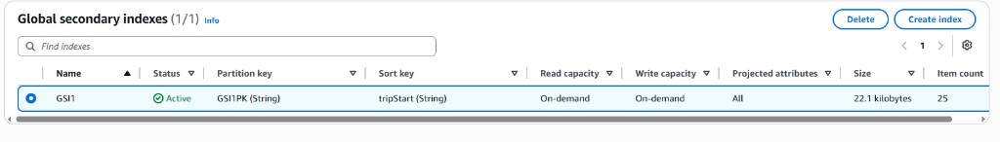

3. Under the **Backups** tab, consider enabling **Point-in-Time Recovery (PITR)** if
   it is not already active — this allows restoring the table to any point in the
   last 35 days in case of accidental data loss. *(Not enabled by default in the
   template — this is an operational hardening step the administrator should evaluate.)*
4. Use the **Explore table items** view to inspect data directly when troubleshooting
   — for example, searching for a specific `USER#{id}` partition to verify a user's
   trips and preferences.

### 4.2 The S3 Documents Bucket

1. Open the **S3 console** and locate the bucket named after **`TripWizDocumentsBucket`**
   (check the CloudFormation stack's **Resources** tab for its generated name).
2. Review its configuration:
   * **Encryption:** Server-side encryption with AES-256 is enabled by default —
     all uploaded trip attachments (tickets, vouchers, passes) are encrypted at rest.
   * **Public access:** All four public-access-block settings are enabled
     (`BlockPublicAcls`, `BlockPublicPolicy`, `IgnorePublicAcls`,
     `RestrictPublicBuckets`) — **the bucket is never publicly accessible**. Files
     are only reachable via short-lived presigned URLs generated by `TripWiz-Trips`.
   * **CORS configuration:** Allows `PUT`, `GET`, and `HEAD` from any origin (`*`),
     exposing the `ETag` header — this is required for the browser-based direct
     upload/download flow to function.

   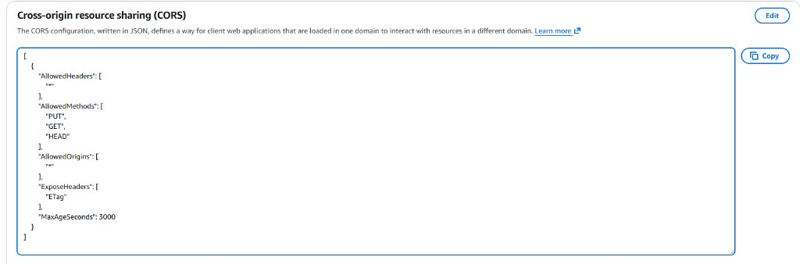

3. **Do not modify the public-access-block or encryption settings** — doing so would
   create a serious data-exposure risk for users' personal travel documents.
4. Periodically review **storage metrics** (under the **Metrics** tab) to track growth
   and anticipate costs (cross-reference Section 10 and the Folder 06 cost estimate).

---

## 5. Managing Identity & Access (Amazon Cognito)

### 5.1 The User Pool

1. Open the **Amazon Cognito console** and locate **`TripWizUserPool`**.
2. Under **Sign-in experience**, confirm `email` is configured as an
   **auto-verified attribute** — new users must verify their email via a confirmation
   code before they can sign in (this is the flow documented in Folder 07, Section 1.1).

   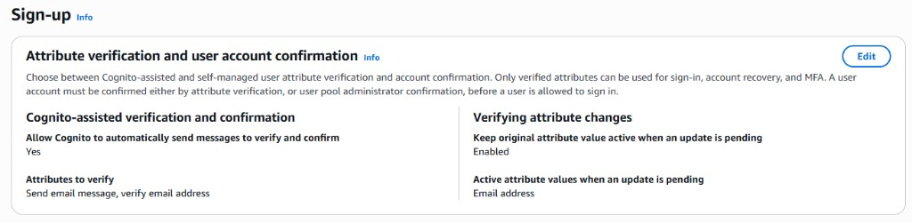

3. Under **App integration → App clients**, locate **`TripWizWebClient`**:
   * **Client secret:** disabled (`GenerateSecret: false`) — appropriate for a
     browser-based single-page app, which cannot securely store a secret.
   * **Authentication flows:** `ALLOW_USER_SRP_AUTH` (Secure Remote Password — used
     for sign-in without ever transmitting the password) and
     `ALLOW_REFRESH_TOKEN_AUTH` (keeps users signed in across sessions).
   * **`PreventUserExistenceErrors`:** enabled — sign-in/sign-up error messages never
     reveal whether a given email is already registered, protecting user privacy.

### 5.2 The Post-Confirmation Trigger (Default Notification Preferences)

`TripWizUserPool` has a **Lambda trigger** wired to its `PostConfirmation` lifecycle
event, pointing at the `TripWiz-PostConfirmation` function (`post_confirmation/index.js`).
It fires automatically the moment a new user verifies their email and their account
becomes confirmed — no action is required from the user or an administrator.

1. Under **User pool properties → Lambda triggers**, confirm **Post confirmation** is
   set to `TripWiz-PostConfirmation`.

   **Post confirmation trigger (live configuration):**

   | Trigger | Lambda function |
   |---------|-----------------|
   | Post confirmation | `TripWiz-PostConfirmation` |

   ARN: `arn:aws:lambda:us-east-1:************:function:TripWiz-PostConfirmation`

2. **What it does:** the function reads the new user's `sub` (user ID), `email`,
   `given_name`, and `family_name` from the confirmation event and writes a default
   **`PREFS`** record for them to `TripWizTable` (`PK = USER#<sub>`, `SK = PREFS`) with
   `notifyTrips: true` — i.e. **every newly confirmed user is opted in to trip-reminder
   and weather-alert emails from the moment they sign up**, without having to first
   visit the Settings page (Folder 07/08) and save preferences.
3. It uses a conditional write (`attribute_not_exists(PK)`) so it never overwrites an
   existing `PREFS` record — re-confirmations or retried Cognito events are safe
   no-ops, and a user who later changes their notification settings keeps their choice.
4. **If a user reports never receiving trip reminders**, check whether their `PREFS`
   item exists and has `notifyTrips: true` (Section 9 shows how to query
   `TripWizTable` / read CloudWatch Logs for `TripWiz-PostConfirmation` and
   `TripWiz-TripReminder`). Accounts created **before** this trigger was deployed will
   not have a seeded record — they will get one only after their first visit to
   Settings, or you may backfill one manually via `aws dynamodb put-item`.

### 5.3 Managing the Admins Group

This is the most important identity-related task for a system administrator: granting
or revoking **in-app Admin Portal** access (documented from the user's perspective in
Folder 08) at the infrastructure level.

1. In the Cognito console, open **`TripWizUserPool` → Groups** and locate the
   **`Admins`** group (precedence: 1).

   **Admins group members (live configuration):**

   | Username | Status |
   |----------|--------|
   | `amitbitton50mail@gmail.com` | CONFIRMED |
   | `davidkitinberg@gmail.com` | CONFIRMED |
   | `sagi.hassid@gmail.com` | CONFIRMED |

2. **To grant admin access to a user:**
   * Click **Add user to group**, search for their username/email, and confirm.
   * Alternatively, an existing in-app admin can promote the user via the Admin
     Portal's **Users** page (Folder 08, Section 3) — this calls the
     `cognito-idp:AdminAddUserToGroup` action under the hood, which the
     `TripWiz-Trips` function's execution role is explicitly permitted to perform.
3. **To revoke admin access**, select the user within the group and click
   **Remove user from group** (or use the in-app **Demote** action).
4. **Bootstrap path:** Before any user exists in the `Admins` group, the
   `AdminBootstrapEmails` stack parameter (set during deployment — see Section 2.2)
   provides a comma-separated **email whitelist** that is granted admin access as a
   fallback. Once your team is fully onboarded into the Cognito `Admins` group, you
   may redeploy with this parameter narrowed down or left as a recovery safety net.

### 5.4 Resetting a User's Password or Investigating Account Issues

1. From the Cognito console, open **Users**, search for the affected user by email or
   username, and open their profile.

   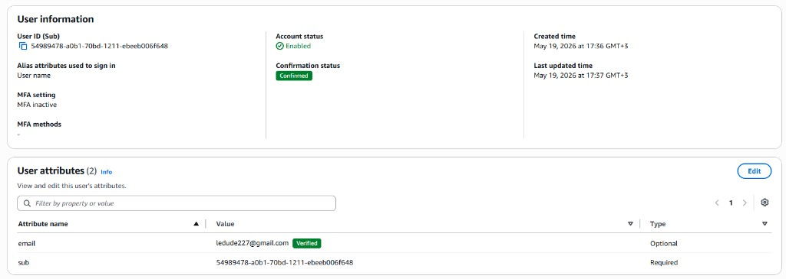

2. From here you can view account status (`CONFIRMED`, `UNCONFIRMED`, `FORCE_CHANGE_PASSWORD`),
   manually confirm a stuck registration, or reset/disable the account directly —
   useful for support escalations the in-app Admin Portal cannot resolve on its own
   (e.g., a user who never received their confirmation email).

---

## 6. Managing AI & Location Services

### 6.1 Amazon Bedrock (AI Route Optimization)

1. Open the **Amazon Bedrock console** and confirm the configured model is available in
   your region. AWS has retired the old standalone **Model access** page; access is now
   managed through **Model catalog** / **Inference profiles** (or is enabled by default
   for serverless models in supported regions).
2. TripWiz invokes **Anthropic Claude Haiku 4.5** via the `BEDROCK_MODEL_ID` environment
   variable on `TripWiz-Trips`. If optimize requests fail, check CloudWatch logs for
   `AccessDeniedException` or model-not-found errors (Section 9.3).

3. The exact model identifier the function is configured to invoke is set via the
   `BEDROCK_MODEL_ID` environment variable
   (`us.anthropic.claude-haiku-4-5-20251001-v1:0`) — visible on the function's
   **Configuration → Environment variables** tab (Section 3.2). To upgrade to a newer
   model version, update this value in `template.yaml` and redeploy; do not edit it
   directly in the console (it will be overwritten on the next deploy).
4. Use **Bedrock's usage metrics** (or CloudWatch, see Section 9) to monitor invocation
   volume and correlate with the cost projections in Folder 06.

### 6.2 Amazon Location Service

1. Open the **Amazon Location Service console**.
2. Under **Place indexes**, locate **`TripWizPlaceIndex`** — confirm its data source
   is **Esri** and intended use is **SingleUse** (appropriate for live, user-facing
   geocoding rather than cached/stored results).

3. Under **Routes**, locate **`TripWizRouteCalculator`** — also backed by **Esri** —
   used to compute road-following routes between itinerary stops.
4. Both resources are referenced by name via the `PLACE_INDEX_NAME` and
   `ROUTE_CALCULATOR_NAME` environment variables on `TripWiz-Trips` and
   `TripWiz-Validate`. Monitor request volume here and compare against the
   12-month free-tier allowance discussed in Folder 06 (Section "Amazon Location
   Service") to anticipate the post-free-tier cost increase.

---

## 7. Managing Notifications

### 7.1 Amazon SES — Sender & Recipient Verification

1. Open the **Amazon SES console** and navigate to **Verified identities**.
2. Confirm that **both** the `SourceEmail` and `AdminEmail` addresses you supplied
   during deployment (Section 2.2) are listed and show a status of **Verified**.

   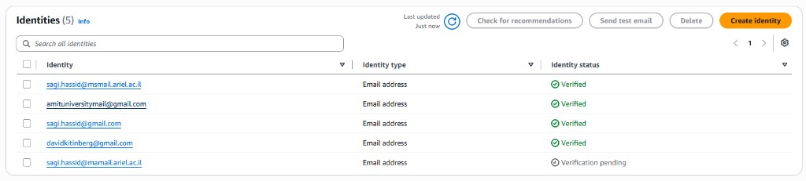

3. **If your account is in the SES Sandbox** (the default for new AWS accounts),
   *every* recipient address must also be individually verified before TripWiz can
   email them — this will block real users from receiving reminder/alert emails in
   production. Submit a **production access request** from the SES console
   (**Account dashboard → Request production access**) before going live.
4. Monitor the **Reputation dashboard** for bounce and complaint rates — sustained
   high rates can result in AWS throttling or suspending your sending privileges.

### 7.2 Amazon SNS — The Alerts Topic

1. Open the **Amazon SNS console** and locate the topic **`TripWiz-Alerts`**.
2. Confirm that **`TripWiz-SnsToSes`** is subscribed as a Lambda endpoint — this is
   the bridge that converts each weather-alert publish (originating from
   `TripWiz-Validate`) into an email sent to the `AdminEmail` address.

   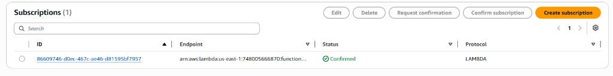

3. Use the **Publish message** test feature here to manually verify the alert→email
   pipeline end-to-end without waiting for a real weather event.

### 7.3 Amazon EventBridge — Scheduled Triggers

TripWiz relies on two scheduled (cron/rate-based) triggers:

| Schedule Name | Expression | Triggers | Purpose |
|---------------|-----------|----------|---------|
| `NightlyTrigger` | `rate(1 day)` | `TripWiz-Validate` | Re-validates weather for all upcoming trips once daily |
| `DailyReminder` | `cron(0 8 * * ? *)` | `TripWiz-TripReminder` | Sends reminder emails at 08:00 UTC (11:00 Israel time) daily |

1. Open the **Amazon EventBridge console → Scheduler** (or **Rules**, depending on
   how the resource is surfaced) and locate both schedules.

   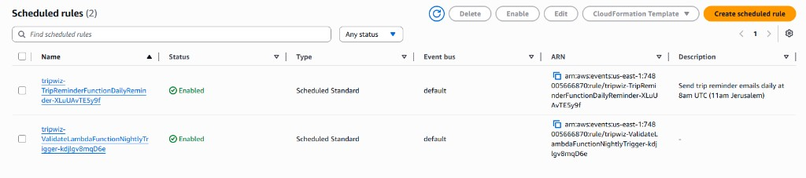

2. To change the reminder timing or frequency, **do not edit the schedule directly in
   the console** — modify the `Schedule` expression in `template.yaml` (or the
   `ReminderDays` parameter for the look-ahead window) and redeploy, so the change is
   versioned and reproducible.
3. Use **Invocation history** (if available in your console view) or CloudWatch Logs
   (Section 9) to confirm the schedules are firing as expected and the target Lambdas
   are completing successfully.

---

## 8. Managing Secrets (AWS Secrets Manager)

### 8.1 Why This Matters

The template provisions **two empty secrets** that must be populated before TripWiz
is fully operational (see Section 2.4):

| Secret Name | Purpose |
|-------------|---------|
| `TripWiz/OpenWeatherApiKey` | API key for the OpenWeatherMap weather-data provider used by `TripWiz-Validate` |
| `TripWiz/MappingApiKey` | API key for any third-party mapping/geocoding provider used alongside Amazon Location Service |

Both are referenced by `TripWiz-Trips` via the `MAPPING_SECRET_ARN` environment
variable, and the function's execution role is granted `secretsmanager:GetSecretValue`
**only** for these specific secret ARNs (least-privilege access).

### 8.2 Populating a Secret's Value

1. Open the **AWS Secrets Manager console** and locate the secret (e.g.,
   `TripWiz/OpenWeatherApiKey`).
2. Click **Retrieve secret value → Edit**.

   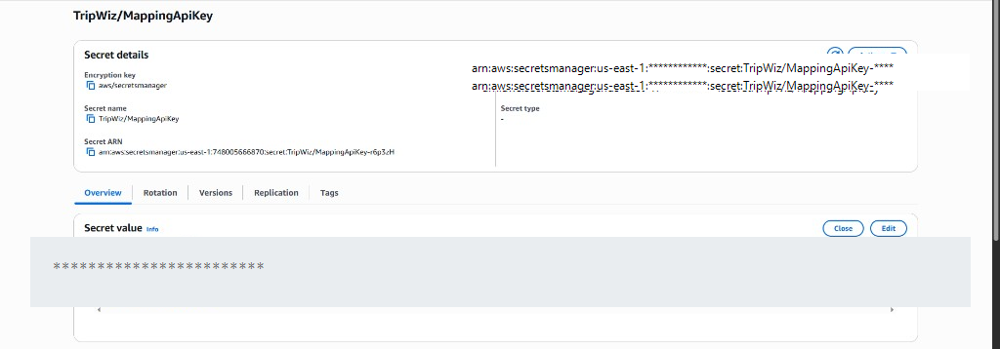

3. Paste the actual API key value obtained from the third-party provider's portal,
   and click **Save**.
4. Repeat for `TripWiz/MappingApiKey`.

> **Operational note:** Lambda functions cache secret values within their execution
> environment after the first retrieval (to minimize Secrets Manager API calls and
> cost — see Folder 06). After **rotating** a secret's value, you may need to wait for
> existing warm execution environments to recycle (or force this by publishing a new
> Lambda version) before all functions pick up the new value.

### 8.3 Rotating Secrets

1. Periodically (e.g., per your organization's security policy, or immediately if a
   key is suspected to be compromised), repeat the steps in Section 8.2 with a freshly
   generated API key from the provider.
2. Update the corresponding key in the third-party provider's dashboard to invalidate
   the old value, ensuring no window where both old and new keys are simultaneously
   "live" longer than necessary.
3. Confirm functionality by triggering a manual weather validation (via the in-app
   **Validate Weather** button on a trip, or by manually invoking `TripWiz-Validate`
   from the Lambda console) and checking CloudWatch Logs for successful API calls.

---

## 9. Monitoring, Logging & Troubleshooting

### 9.1 CloudWatch Log Groups

1. Open the **CloudWatch console → Log groups**. Each Lambda function automatically
   has its own log group, named `/aws/lambda/<FunctionName>` (e.g.,
   `/aws/lambda/TripWiz-Trips`).

   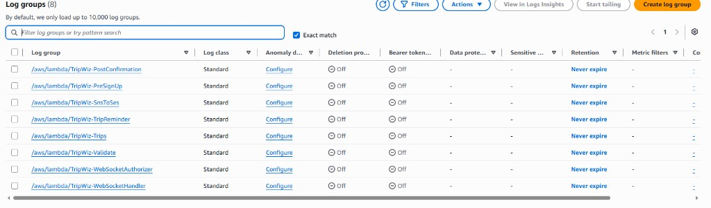

2. Click into a log group and select a recent **log stream** to view individual
   invocation logs — every function logs key events (e.g., `"WebSocket event:"`,
   `"TripReminder Lambda invoked"`, `"WebSocket authorizer rejected token"`) that are
   invaluable for diagnosing issues.

3. Use **CloudWatch Logs Insights** to run structured queries across a function's logs
   — for example, to find all `ConditionalCheckFailedException` (version-conflict)
   occurrences in `TripWiz-Trips` over the last 24 hours:
   ```
   fields @timestamp, @message
   | filter @message like /ConditionalCheckFailedException/
   | sort @timestamp desc
   ```

### 9.2 Setting Up Alarms

1. From any metric view (e.g., a Lambda function's **Monitor** tab, or a log group's
   **Metric filters**), click **Create alarm**.
2. Recommended alarms for TripWiz's production health:
   * **Lambda Errors > 0** for `TripWiz-Trips` and `TripWiz-WebSocketHandler` (the
     two highest-traffic functions) — notify the operator immediately on any failure
     spike.
   * **Lambda Duration approaching Timeout** for `TripWiz-Trips` (60s timeout) — an
     early warning that downstream calls (Bedrock, DynamoDB, S3) are slowing down.
   * **API Gateway 5XX Error Rate** for both `TripWizApi` and `TripWizWebSocketApi`.
   * **DynamoDB ThrottledRequests** — though rare with on-demand billing, sustained
     throttling indicates an extreme traffic spike worth investigating.
3. Configure each alarm to publish to an **SNS topic** that emails or pages the
   on-call administrator.

   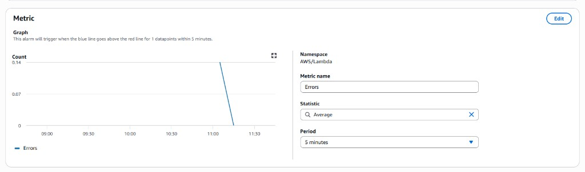

### 9.3 Common Issues & Resolutions

| Symptom | Likely Cause | Resolution |
|---------|-------------|------------|
| Users report AI Optimize failing | Bedrock model access not enabled, or `BEDROCK_MODEL_ID` mismatch | Check Section 6.1; verify model access is **Granted** in the Bedrock console |
| Weather validation returns no data | `OpenWeatherApiKey` secret is empty or invalid | Re-populate the secret per Section 8.2; check `TripWiz-Validate` logs for HTTP errors from Open-Meteo/OpenWeather |
| Reminder/alert emails not arriving | SES sandbox mode, unverified sender/recipient, or `notifyTrips` disabled by the user | Check Section 7.1 (SES verification + production access); confirm the user's notification preference in their Account Settings |
| Live co-editing not connecting | WebSocket authorizer rejecting tokens, or stale connection records | Check `TripWiz-WebSocketAuthorizer` logs for `"WebSocket authorizer rejected token"`; stale `CONN#` items self-expire via DynamoDB TTL |
| "Version conflict" errors on trip edits | Two collaborators saved overlapping changes (optimistic concurrency control working as intended) | This is expected behavior — instruct the affected user to refresh and reapply their change. Investigate further only if it occurs persistently for a single trip |
| `410 Gone` errors in WebSocket broadcast logs | A connected client disconnected without a clean `$disconnect` event | Expected and self-healing — `TripWiz-WebSocketHandler` automatically deletes stale connection records on `410` responses (see `broadcast()` in `ws_handler/index.js`) |
| New deployment fails with `ROLLBACK_COMPLETE` | A resource conflict or invalid parameter value | Review the **CloudFormation Events** tab (Section 2.3) for the specific failing resource and error message; you may need to delete the failed stack before retrying |

---

## 10. Cost Oversight

### 10.1 Where to Monitor Spend

1. Open the **AWS Cost Explorer** console and filter by **service** to see TripWiz's
   actual monthly spend broken down by Lambda, Bedrock, DynamoDB, Amazon Location
   Service, and so on. *(Cost Explorer data may take up to 24 hours to appear after
   first enabling the service — until then, use the projections in [`06.md`](../06/06.md).)*

2. Compare actuals against the **detailed projected estimate in [`06.md`](../06/06.md)**
   (Folder 06 — Cost Calculation), which itemizes every service with its expected
   monthly cost, the official AWS Pricing Calculator export, and a month-by-month
   year-1 growth projection. Significant deviations from that baseline are an early
   signal worth investigating (e.g., an unexpected spike in Bedrock invocations could
   indicate a client-side bug causing repeated optimize calls).

### 10.2 Setting Up Budget Alerts

1. Open the **AWS Budgets console** and click **Create budget**.
2. Configure a **monthly cost budget** with a threshold informed by the Folder 06
   projections (e.g., alert at 80% of the projected ~$200/month year-1 figure, and
   again if spend approaches the ~$313/month steady-state figure).

   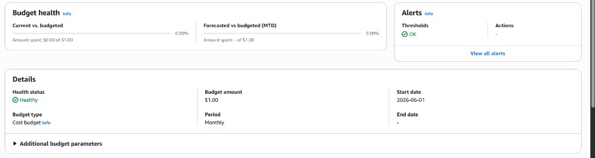

3. Add an **email/SNS notification** so the administrator is alerted before costs
   significantly exceed projections — particularly important given that **Amazon
   Bedrock** and **Amazon Location Service** are the two largest and most
   usage-sensitive cost drivers identified in Folder 06.

---

## 11. Manual Completion Checklist (AWS Operations)

Before submitting this section of Folder 11, ensure that:

- [x] Every screenshot placeholder above has been replaced with an actual image, route
      listing, or live configuration table from the deployed TripWiz stack.
- [x] Screenshots have sensitive values (account IDs, ARNs containing account
      numbers, secret values, email addresses) appropriately redacted before
      submission, consistent with good security hygiene.
- [x] All console steps have been verified against the actual deployed stack — if the
      infrastructure has evolved since this manual was drafted (e.g., additional
      resources added to `template.yaml`), update the relevant sections accordingly.
- [x] This written manual is treated as the **primary, authoritative deliverable** for
      system administration — any supplementary video walkthroughs or in-app help
      content are referenced as additional resources only, not substitutes.

---

# Part Two — Developer Documentation (Interface Reference)

> **Status: pending input.** The lecturer's guidelines for Folder 11 require that this
> document also serve as **developer/handoff documentation**, written in the style of
> professional library documentation (e.g., the [Boto3 documentation](https://boto3.amazonaws.com/v1/documentation/api/latest/index.html)),
> targeted at a developer audience that already knows programming and AWS. This
> requires documenting **every interface of every microservice/component the system
> calls** — its exact name, purpose, input parameters (with data formats), and
> response format.
>
> This section will be filled in collaboratively, working through the system's
> microservices/components one at a time and specifying each of their interfaces in
> full. See the questions below to get started.
