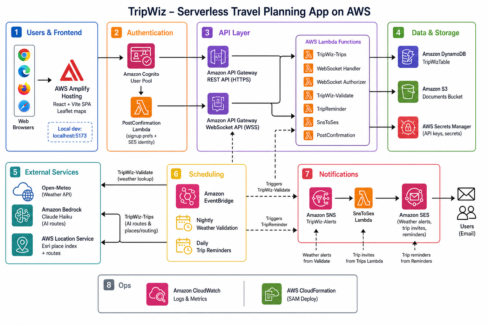

# TripWiz

TripWiz is a serverless travel planning application for building, organizing, validating, and sharing complete trip plans. It helps travelers and trip organizers manage daily itineraries, map-based routes, weather-aware activity planning, travel logistics, documents, notes, and collaboration from one web interface. The project is useful for users who want more than a static checklist: it combines itinerary management, live collaboration, AWS-backed data storage, weather validation, and AI-assisted route optimization in a single planning workflow.

## Project Description

TripWiz is designed around the full trip planning lifecycle. A user signs up, creates a trip with dates, adds destinations and activities to daily itinerary slots, views those stops on an interactive map, and can validate outdoor plans against forecasted weather. When weather conditions may disrupt an activity, the backend stores alerts and suggests nearby indoor alternatives.

The application also includes a trip overview hub for logistics outside the day-by-day itinerary. Users can manage flights, accommodations, rental cars, trip documents, notes, and packing categories. Trip data is saved through a REST API backed by DynamoDB, while WebSocket support enables real-time collaborative trip editing for invited users.

Administrators have a dedicated dashboard for platform monitoring and moderation, including user management, trip management, and trending destination configuration.

## Key Features

- **User authentication**
  - Sign up, email confirmation, sign in, sign out, session validation, and protected routes are implemented with Amazon Cognito.

- **Trip creation and management**
  - Users can create, list, view, update, and delete trips.
  - Trips include title, start date, end date, itinerary data, metadata, ownership, collaborators, and versioning for concurrent edits.

- **Daily itinerary planning**
  - The trip planner supports multi-day itineraries with stops grouped by day.
  - Each stop can include a place name, coordinates, day, time, activity type, and duration.
  - Users can edit trip titles, add and remove stops, adjust stop times, and organize stops by day.

- **Place search and autocomplete**
  - The frontend includes OpenStreetMap/Nominatim autocomplete behavior.
  - The backend also exposes an Amazon Location Service place search endpoint for server-side place lookup.

- **Interactive map**
  - React Leaflet and Leaflet render trip stops on a map.
  - Stops are grouped by day and displayed with route geometry where route calculation is available.
  - Backend route calculation uses AWS Location Service.

- **Weather validation and alerts**
  - Users can trigger on-demand weather validation for a trip.
  - A scheduled validation Lambda also checks upcoming trips.
  - Forecast data is retrieved from Open-Meteo and evaluated with activity-aware rules for outdoor, indoor, beach, ski, and scenic-view activities.
  - Weather results, alerts, validation metadata, and fallback suggestions are persisted in DynamoDB.

- **Alternative indoor suggestions**
  - When weather creates an alert for a stop, the backend searches nearby indoor alternatives such as museums, galleries, shopping malls, cinemas, and aquariums using Amazon Location Service.
  - The trip planner can show fallback suggestions and replace an affected stop with a selected alternative.

- **AI route optimization**
  - The backend can call Amazon Bedrock with Claude Haiku to suggest a more efficient daily itinerary order.
  - The optimizer respects fixed anchors such as flights, airports, transit stops, and hotel check-in/check-out constraints.

- **Real-time collaboration**
  - API Gateway WebSocket routes support joining and leaving trip rooms, edit events, cursor events, and ping messages.
  - The frontend connects to the WebSocket API with a Cognito access token and shows online/offline collaboration state.

- **Trip sharing and collaborators**
  - Trip owners can invite existing TripWiz users by email.
  - Collaborator access records are stored in DynamoDB.
  - Owners can list and remove collaborators.
  - Link sharing can be enabled for signed-in users with read-only access, while editing still requires an invitation.

- **Flights, accommodation, and rental car management**
  - The trip overview page supports structured flight records, accommodations, and rental cars.
  - Flight records include departure and arrival airports, dates, times, airline, flight number, terminals, gates, price, status, and notes.
  - Accommodation records include type, check-in/check-out dates, address, and notes.
  - Rental car records include pickup and return details, car type, confirmation number, price, and notes.

- **Documents and attachments**
  - Users can upload PDF, PNG, JPG/JPEG, WEBP, and DOCX documents up to 10 MB.
  - Uploads use S3 presigned URLs so files are transferred directly from the browser to S3.
  - Attachments can be associated with a trip, flight, accommodation, or rental car.
  - Download URLs and deletion are handled through authenticated backend endpoints.

- **Notes and packing list**
  - The overview hub includes trip notes and packing list categories.
  - Packing data is stored in trip metadata and supports checked/unchecked item state.

- **Export**
  - The frontend supports exporting selected trip sections to PDF or Excel using `jspdf`, `jspdf-autotable`, and `xlsx`.

- **User preferences**
  - Account settings can store first name, last name, currency, timezone, language, and notification preferences.

- **Email notifications**
  - Weather alerts are published through SNS and converted to email through SES.
  - A scheduled trip reminder Lambda sends reminder emails before upcoming trips.
  - Collaborator invite emails are sent through SES on a best-effort basis after access is granted.

- **Admin dashboard**
  - Admin routes include overview metrics, user management, trip moderation, and trending destination management.
  - Admins can list users, suspend/unsuspend users, promote/demote users, delete user accounts, list/search trips, hide/unhide trips, delete trips, and edit trending destinations.
  - Admin access is checked through the Cognito `Admins` group or a bootstrap email whitelist.

## Architecture Overview

TripWiz uses a React frontend and an AWS SAM serverless backend. The frontend communicates with REST and WebSocket APIs exposed through API Gateway. Lambda functions implement business logic, DynamoDB stores application data, S3 stores uploaded documents, and supporting AWS services provide authentication, routing, email, weather alerts, and AI optimization.



### Frontend Architecture

- Built with React 18 and Vite.
- Uses React Router for public, authenticated, and admin routes.
- Stores runtime service endpoints in `frontend/src/config.js`.
- Uses service modules for Cognito auth, REST API calls, admin checks, and WebSocket communication.
- Main user pages include:
  - `HomePage`
  - `LoginPage`
  - `TripsPage`
  - `TripPage`
  - `TripOverviewPage`
  - `AccountSettings`
  - Admin pages for overview, users, trips, and trending destinations.

### Backend Architecture

- Built with Node.js Lambda functions.
- Infrastructure is defined in `backend/infra/template.yaml` using AWS SAM.
- The main REST Lambda, `backend/src/rest_handlers/trips.js`, handles trip CRUD, attachments, collaboration, places, routes, admin APIs, trending destinations, and user preferences.
- Separate Lambda functions handle weather validation, WebSocket events, WebSocket authorization, trip reminders, Cognito post-confirmation, and SNS-to-SES email forwarding.

### Serverless Data Flow

1. The React frontend authenticates users with Cognito.
2. The frontend sends REST requests to API Gateway with a Cognito JWT in the `Authorization` header.
3. API Gateway validates the JWT with a Cognito authorizer.
4. Lambda handlers process requests and read/write data in DynamoDB.
5. Route and place requests use AWS Location Service.
6. Document upload requests generate S3 presigned URLs; the browser uploads files directly to S3.
7. Weather validation invokes the validation Lambda, which calls Open-Meteo and persists results to DynamoDB.
8. Weather alerts are published to SNS and emailed through SES.
9. WebSocket clients connect through API Gateway WebSocket using a Cognito access token in the query string.
10. WebSocket events are processed by Lambda and broadcast to active trip collaborators.

### Authentication Flow

1. A user signs up with email and password through Cognito.
2. Cognito sends an email verification code.
3. After confirmation, the Cognito post-confirmation Lambda creates default user preference data.
4. Sign-in uses Cognito SRP through `amazon-cognito-identity-js`.
5. The frontend stores the active Cognito session through the Cognito SDK.
6. REST API calls use the Cognito ID token.
7. WebSocket connections use the Cognito access token.
8. Admin access is granted through the `Admins` Cognito group or the configured bootstrap admin email list.

### Weather Validation Flow

1. The user clicks **Check Weather**, or the scheduled EventBridge rule invokes the validation Lambda.
2. The validation Lambda loads the relevant trip itinerary from DynamoDB.
3. For each scheduled stop with coordinates, it fetches forecast data from Open-Meteo.
4. The stop is categorized as indoor, general outdoor, beach, ski, or scenic view.
5. Weather thresholds are applied for rain probability, heat, wind, gusts, snow conditions, cloud cover, and visibility.
6. Weather data is stored in DynamoDB.
7. Alert records are created for problematic stops.
8. Indoor alternatives are searched through AWS Location Service and stored as fallback suggestions.
9. Alerts are published to SNS and forwarded to SES email notifications.

### File Upload Flow

1. The frontend requests an upload URL for a file.
2. The backend validates file name, type, size, and related trip item.
3. The backend creates a pending attachment record in DynamoDB and returns a presigned S3 PUT URL.
4. The browser uploads the file directly to S3.
5. The frontend calls the complete endpoint.
6. The backend verifies the object in S3 and marks the attachment as uploaded.
7. Download requests return short-lived presigned S3 GET URLs.

### Admin Flow

1. Admin pages are protected by a frontend route guard.
2. The backend independently checks admin authorization for every admin endpoint.
3. Admin identity is based on Cognito `Admins` group membership or the `ADMIN_EMAILS` bootstrap list.
4. Admin APIs read Cognito users, aggregate trip data from DynamoDB, update trending destinations, and perform moderation actions.

## Technology Stack

### Frontend

- React 18
- Vite 5
- JavaScript
- React Router
- Leaflet
- React Leaflet
- Lucide React
- Amazon Cognito Identity JS
- jsPDF
- jsPDF AutoTable
- xlsx

### Backend

- Node.js Lambda functions
- AWS SAM
- AWS SDK for JavaScript v3
- Jest
- node-fetch

### AWS and External Services

- Amazon API Gateway REST API
- Amazon API Gateway WebSocket API
- AWS Lambda
- Amazon DynamoDB
- Amazon Cognito
- Amazon S3
- Amazon SNS
- Amazon SES
- Amazon EventBridge
- AWS Location Service
- AWS Secrets Manager
- Amazon Bedrock
- AWS CloudFormation / SAM
- AWS Amplify hosting configuration for the frontend
- Open-Meteo
- OpenStreetMap / Nominatim
- Wikipedia image API

## AWS Services Used

| Service | Role in TripWiz |
| --- | --- |
| API Gateway REST API | Exposes authenticated HTTP endpoints for trips, attachments, validation, routes, places, preferences, trending destinations, and admin operations. |
| API Gateway WebSocket API | Provides real-time collaboration channels for trip editing and presence-style connection state. |
| Lambda | Runs backend business logic for REST APIs, weather validation, WebSocket handling, WebSocket authorization, reminders, Cognito post-confirmation, and SNS-to-SES email forwarding. |
| DynamoDB | Stores trips, access records, collaborator records, user preferences, weather data, alerts, fallback suggestions, WebSocket connections, attachments metadata, and platform settings. |
| Cognito | Handles user sign-up, email confirmation, sign-in, JWT issuance, protected API access, and admin group membership. |
| S3 | Stores trip document uploads under a private bucket with server-side encryption and CORS for browser uploads. |
| SNS | Receives weather alert events from the validation Lambda. |
| SES | Sends weather alert emails, trip reminder emails, collaborator invite emails, and verifies user email identities after signup. |
| EventBridge | Runs scheduled validation and trip reminder workflows. |
| AWS Location Service | Provides place search, fallback venue discovery, geocoding-related search, and road route calculation. |
| Secrets Manager | Stores the mapping API secret placeholder used by backend configuration. |
| Bedrock | Runs Claude Haiku route optimization for itinerary reordering. |
| CloudFormation / SAM | Defines and deploys the backend infrastructure as code. |
| Amplify | The repository includes `frontend/amplify.yml` for static frontend build and hosting through AWS Amplify. |

## Project Structure

```text
TripWiz/
|-- README.md
|-- README_draft.md
|-- WEATHER_LOGIC_DOCUMENTATION.md
|-- backend/
|   |-- README.md
|   |-- api/
|   |   `-- REST_and_WebSocket_API.md
|   |-- db/
|   |   `-- dynamodb_schema.md
|   |-- infra/
|   |   |-- template.yaml
|   |   |-- samconfig.toml
|   |   |-- trips-env.json
|   |   `-- trips-ses-policy.json
|   `-- src/
|       |-- lib/
|       |-- post_confirmation/
|       |-- rest_handlers/
|       |-- sns_to_ses/
|       |-- trip_reminder/
|       |-- validate_lambda/
|       |-- ws_authorizer/
|       |-- ws_handler/
|       `-- package.json
|-- frontend/
|   |-- amplify.yml
|   |-- index.html
|   |-- package.json
|   |-- vite.config.js
|   |-- public/
|   `-- src/
|       |-- App.jsx
|       |-- config.js
|       |-- components/
|       |-- data/
|       |-- pages/
|       |-- services/
|       `-- styles/
|-- images/
`-- tools/
    `-- convert_airports.py
```

### Important Files

| Path | Purpose |
| --- | --- |
| `frontend/src/App.jsx` | Defines public, private, and admin routes. |
| `frontend/src/config.js` | Contains frontend runtime configuration for Cognito, REST API, and WebSocket endpoints. |
| `frontend/src/pages/TripPage.jsx` | Main itinerary planner with map integration, collaboration, weather checks, and route optimization. |
| `frontend/src/pages/TripOverviewPage.jsx` | Logistics hub for flights, accommodation, rental cars, documents, notes, packing list, and export. |
| `frontend/src/services/api.js` | REST API client and S3 presigned upload helper. |
| `frontend/src/services/auth.js` | Cognito authentication functions. |
| `frontend/src/services/websocket.js` | WebSocket client for collaborative trip editing. |
| `backend/infra/template.yaml` | AWS SAM template defining the backend infrastructure. |
| `backend/src/rest_handlers/trips.js` | Main REST API Lambda handler. |
| `backend/src/validate_lambda/index.js` | Weather validation, alert creation, fallback search, and SNS publishing. |
| `backend/src/ws_handler/index.js` | WebSocket room and edit handling. |
| `backend/src/ws_authorizer/index.js` | Cognito access-token validation for WebSocket connections. |
| `backend/src/trip_reminder/index.js` | Scheduled trip reminder emails. |
| `backend/src/sns_to_ses/index.js` | Converts SNS weather alerts into SES emails. |
| `backend/src/lib/optimize.js` | Bedrock route optimization logic. |
| `backend/db/dynamodb_schema.md` | DynamoDB single-table schema notes. |
| `backend/api/REST_and_WebSocket_API.md` | API contract documentation. |

## Installation Prerequisites

Install the following before running or deploying the project:

- Git
- Node.js 20 or newer
- npm
- AWS CLI v2
- AWS SAM CLI
- An AWS account
- AWS credentials configured locally
- SES-verified sender email for production email delivery
- Bedrock model access enabled for the configured Claude model if using route optimization

The SAM template currently uses the Lambda runtime `nodejs24.x`. Make sure your AWS account and SAM CLI version support that runtime.

## How to Run Locally

The frontend can run locally with Vite. The backend is designed for AWS SAM deployment and can be tested locally at the Lambda level, but the frontend configuration currently points to deployed AWS endpoints in `frontend/src/config.js`.

### 1. Clone the Repository

```bash
git clone <repository-url>
cd TripWiz
```

### 2. Install Frontend Dependencies

```bash
cd frontend
npm install
```

### 3. Install Backend Dependencies

```bash
cd ../backend/src
npm install
```

### 4. Configure Frontend Runtime Values

Update `frontend/src/config.js` with the values from your deployed backend:

```js
const config = {
  region: 'us-east-1',
  cognito: {
    userPoolId: '<cognito-user-pool-id>',
    userPoolWebClientId: '<cognito-app-client-id>',
  },
  api: {
    baseUrl: 'https://<rest-api-id>.execute-api.<region>.amazonaws.com/prod',
  },
  websocket: {
    url: 'wss://<websocket-api-id>.execute-api.<region>.amazonaws.com/prod',
  },
};

export default config;
```

Do not put AWS secret keys or private credentials in this file. Cognito pool IDs and API URLs are public application configuration, not secrets.

### 5. Start the Frontend

```bash
cd frontend
npm run dev
```

Vite will print the local development URL, usually:

```text
http://localhost:5173
```

### 6. Build the Frontend

```bash
cd frontend
npm run build
```

### 7. Preview the Production Build

```bash
cd frontend
npm run preview
```

## Backend Local Commands

From the `backend/` directory:

```bash
sam validate --template-file infra/template.yaml --region us-east-1
sam build --template-file infra/template.yaml --region us-east-1
```

Run backend Jest tests:

```bash
cd backend/src
npm test
```

Invoke the weather validation Lambda locally with the provided test event:

```bash
cd backend
sam local invoke ValidateLambdaFunction --template-file infra/template.yaml --event src/validate_lambda/test-event.json
```

Local SAM invocation may require Docker and AWS-compatible environment configuration depending on which Lambda is invoked.

## Environment Variables and Configuration

### Frontend Configuration

`frontend/src/config.js` contains:

| Key | Description |
| --- | --- |
| `region` | AWS region used by Cognito and deployed APIs. |
| `cognito.userPoolId` | Cognito User Pool ID. |
| `cognito.userPoolWebClientId` | Cognito app client ID used by the web app. |
| `api.baseUrl` | Base URL of the REST API Gateway stage. |
| `websocket.url` | URL of the API Gateway WebSocket stage. |

### SAM Parameters

Defined in `backend/infra/template.yaml`:

| Parameter | Description |
| --- | --- |
| `AdminEmail` | Email address that receives TripWiz alert emails. Must be verified in SES. |
| `SourceEmail` | SES-verified sender email address for application emails. |
| `AdminBootstrapEmails` | Comma-separated email list granted initial admin access. |
| `ReminderDays` | Number of days before a trip starts to send reminder emails. Default is `2`. |
| `FrontendUrl` | Public frontend URL used in transactional emails. |

Example parameter override:

```bash
sam deploy --guided --region us-east-1
```

When prompted, provide placeholder-style values such as:

```text
AdminEmail=admin@example.com
SourceEmail=no-reply@example.com
AdminBootstrapEmails=admin@example.com
ReminderDays=2
FrontendUrl=https://example.com
```

### Lambda Environment Variables

These are configured by the SAM template:

| Variable | Used By | Description |
| --- | --- | --- |
| `TABLE_NAME` | REST, validation, WebSocket, reminders, post-confirmation | DynamoDB table name. |
| `ALERTS_TOPIC_ARN` | Validation, WebSocket | SNS topic for weather alerts. |
| `PLACE_INDEX_NAME` | REST, validation | AWS Location place index. |
| `ROUTE_CALCULATOR_NAME` | REST | AWS Location route calculator. |
| `VALIDATE_FUNCTION_NAME` | REST | Lambda function name for on-demand validation. |
| `USER_POOL_ID` | REST | Cognito user pool ID for admin and collaborator lookups. |
| `BEDROCK_MODEL_ID` | REST optimization | Bedrock model ID for route optimization. |
| `WS_ENDPOINT` | REST | API Gateway Management API endpoint for WebSocket broadcasts. |
| `DOCUMENTS_BUCKET` | REST attachments | S3 bucket for trip documents. |
| `SOURCE_EMAIL` | Email Lambdas | Verified SES sender. |
| `ADMIN_EMAIL` | SNS-to-SES | Admin recipient email. |
| `ADMIN_EMAILS` | REST admin auth | Bootstrap admin email list. |
| `FRONTEND_URL` | Email helpers | Public frontend URL used in emails. |
| `REMINDER_DAYS` | Trip reminder | Days before trip start for reminders. |

### Secrets Manager

The SAM template defines:

| Secret | Purpose |
| --- | --- |
| `TripWiz/MappingApiKey` | Placeholder for mapping-service configuration. Current place and route logic uses AWS Location Service resources from the SAM stack. |

Open-Meteo weather validation does not require an API key.

## Testing

Backend tests are implemented with Jest under `backend/src`.

```bash
cd backend/src
npm test
```

Current backend test coverage includes REST handler behavior, weather validation behavior, and WebSocket handler behavior.

The frontend package does not currently define a test script. Use the build command as a basic frontend verification step:

```bash
cd frontend
npm run build
```

## Deployment

### Backend Deployment with AWS SAM

Configure AWS credentials:

```bash
aws configure
aws sts get-caller-identity
```

Validate and build:

```bash
cd backend
sam validate --template-file infra/template.yaml --region us-east-1
sam build --template-file infra/template.yaml --region us-east-1
```

Deploy:

```bash
sam deploy --guided --template-file infra/template.yaml --region us-east-1
```

After deployment, record the stack outputs:

- REST API URL
- WebSocket endpoint
- Cognito User Pool ID
- Cognito User Pool Client ID
- DynamoDB table name

Use those values to update `frontend/src/config.js`.

### Frontend Deployment

The repository includes `frontend/amplify.yml`, which builds the Vite app for AWS Amplify Hosting:

```yaml
version: 1
frontend:
  phases:
    preBuild:
      commands:
        - npm ci
    build:
      commands:
        - npm run build
  artifacts:
    baseDirectory: dist
```

The SAM template does not currently define frontend hosting infrastructure. The frontend can be deployed through AWS Amplify or any static hosting provider that supports React single-page applications.

## Screenshots

Add screenshots of the main dashboard, trip planner, map, trip overview hub, document upload flow, and admin panel here.

Suggested screenshots:

- Home page
- Trips dashboard
- Daily itinerary planner
- Interactive map with routes
- Weather alert and indoor fallback suggestions
- Trip overview logistics page
- Admin overview dashboard
- Admin user and trip management pages

## Future Improvements

- Move frontend runtime configuration to environment-specific build variables.
- Add frontend automated tests.
- Add a formal invitation acceptance flow for collaborators.
- Add password reset and optional MFA flows.
- Add audit logging for admin actions.
- Add frontend hosting infrastructure to the SAM or CloudFormation stack.
- Add pagination controls for larger admin user and trip datasets.
- Add more detailed notification preference handling and UI feedback.

## Contributors

- Amit Bitton
- David Kitinberg
- Sagi Hassid
