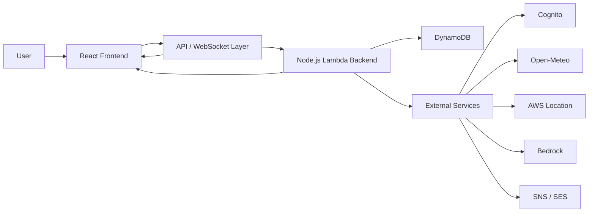

# TripWiz Main Flow Reference

This file is a practical memory aid for the most important TripWiz flow: creating a trip, opening it, editing it, saving it, and validating weather.

The goal is simple: when you forget how the app works, start here.

## 1. The Big Picture

TripWiz has two main parts:

- The frontend is a React app in `frontend/`.
- The backend is a Node.js API running in AWS Lambda under `backend/`.

The frontend shows the screen and collects user actions.
The backend owns the real data, permissions, and business logic.

In practice:

1. React renders the UI.
2. React calls `frontend/src/services/api.js`.
3. `api.js` sends HTTP requests to the backend.
4. The backend reads or writes DynamoDB and returns JSON.
5. React updates the screen from the response.

## 2. The Central Flow: Add a Trip

This is the most important flow to understand first.

### Step A: The user fills the form

In `frontend/src/pages/TripsPage.jsx`, the page keeps the form in React state:

- `title`
- `startDate`
- `endDate`

That means the typed values live inside the component before anything is saved.

### Step B: The user clicks create

The `createTrip()` handler in `TripsPage.jsx` does this:

1. Stops the browser form submit.
2. Sets loading state with `setCreating(true)`.
3. Calls `api.createTrip(form)`.
4. Waits for the backend response.
5. Navigates to `/trips/{tripId}`.

### Step C: `api.js` sends the request

`frontend/src/services/api.js` wraps all HTTP calls.

For create trip, it sends:

- `POST /trips`
- JSON body with the form data
- Cognito Authorization token in the header

This file is important because the UI does not talk directly to the backend everywhere. It goes through one shared service.

### Step D: The backend creates the trip

In `backend/src/rest_handlers/trips.js`, the `POST /trips` branch:

1. Reads the request body.
2. Generates a new trip id like `t-...`.
3. Builds the trip object.
4. Stores it in DynamoDB.
5. Creates access records for the owner and collaborators.
6. Returns `{ tripId, trip }`.

The trip is stored with:

- owner data
- title
- dates
- itinerary
- collaborators
- version number

### Step E: React moves to the trip page

After the backend returns the new id, the frontend navigates to the trip page.

That is why the create flow feels instant: the UI only needs the new id, then it can open the editor.

## 3. What Happens When the Trip Page Opens

The main editor is `frontend/src/pages/TripPage.jsx`.

When the page opens, it loads several things:

- the trip itself
- alerts
- fallback suggestions
- weather data

It does that with `useEffect` and calls like:

- `api.getTrip(tripId)`
- `api.getTripAlerts(tripId)`
- `api.getTripFallbacks(tripId)`
- `api.getTripWeather(tripId)`

This is the first mental model to remember:

- React shows the screen.
- `useEffect` loads the data.
- `api.js` fetches it.
- the backend returns JSON.

## 4. How Editing Works

Editing in TripWiz is mostly local first, then saved to the server.

### Local editing

When you change a stop, the page updates React state first.

Examples:

- change a stop time
- move a stop to another day
- rename the trip
- add or remove a stop

This is why the screen reacts immediately.

### Save later

`TripPage.jsx` does not send every tiny change immediately.
It waits a little, then saves with a debounce.

The save flow is:

1. Update local React state.
2. Mark the trip as unsaved.
3. Wait a short delay.
4. Call `api.updateTrip(tripId, patch)`.
5. Update the local version from the server response.

### Why version numbers matter

The backend uses optimistic concurrency.

That means:

- each trip has a `version`
- the frontend sends the version it thinks is current
- the backend rejects the update if someone else already changed the trip

If that happens, the UI shows a version conflict message.

This protects against overwriting another person’s edits.

## 5. What `useState` Means Here

`useState` is how React stores values inside a component.

In TripWiz, `useState` is used for things like:

- the trip data
- the list of stops
- form fields
- loading flags
- error messages
- validation results
- selected tabs
- open/closed modals

The key idea:

- when the state changes, React re-renders the screen

That is why the UI feels alive.

## 6. What `useEffect` Means Here

`useEffect` is for things that happen outside the normal render.

TripWiz uses it for:

- loading data when the page opens
- connecting to WebSocket
- listening for outside clicks
- running route calculations after the stop list changes
- cleaning up listeners when the component closes

The key idea:

- render first
- then run the side effect
- clean it up if needed

This is why `useEffect` is the right tool for API calls and subscriptions.

## 7. What `api.js` Does

`frontend/src/services/api.js` is the shared request layer.

It does three important things:

1. Adds the Cognito token to requests.
2. Sends the request to the right backend URL.
3. Turns HTTP errors into normal JavaScript errors.

That means the UI can just call functions like:

- `api.getTrip(tripId)`
- `api.createTrip(form)`
- `api.updateTrip(tripId, patch)`
- `api.validateTrip(tripId)`

This keeps the React pages cleaner.

## 8. Why WebSocket Exists

TripWiz uses WebSocket for live collaboration.

That means if one person edits a trip, other connected users can see the update without refreshing.

In `TripPage.jsx`:

- `connect(tripId)` opens the socket
- `on('edit', ...)` listens for incoming changes
- `disconnect()` closes the socket on cleanup

This is a good example of why `useEffect` needs cleanup.

## 9. Weather Validation Flow

This is another key flow after create/edit.

The validation button does this:

1. Checks that there is at least one stop with a location and time.
2. Calls `api.validateTrip(tripId)`.
3. Polls the backend until validation results are ready.
4. Loads alerts, fallback suggestions, and weather data.
5. Updates the UI with warnings or success.

That flow is controlled in `TripPage.jsx`.

The backend route lives in `backend/src/rest_handlers/trips.js`.

## 10. The Data You Should Remember

The app mostly works with these ideas:

- **Trip**: the main record
- **Stop**: one location in the itinerary
- **Access**: owner/editor/viewer permission
- **Version**: used to prevent conflicting saves
- **Alerts**: weather warnings for stops
- **Fallbacks**: alternative indoor suggestions
- **Weather**: forecast data for the itinerary

If you remember these seven words, the code becomes much easier to follow.

## 11. Where to Look in the Code

When you want to refresh your memory, open these files in this order:

1. `frontend/src/pages/TripsPage.jsx` — create trip flow.
2. `frontend/src/pages/TripPage.jsx` — edit, save, validate, WebSocket.
3. `frontend/src/services/api.js` — all backend calls.
4. `backend/src/rest_handlers/trips.js` — backend trip logic.

## 12. Short Cheat Sheet

- React state stores the current UI values.
- `useEffect` runs side effects like fetch and WebSocket setup.
- `api.js` is the bridge between React and the backend.
- Backend code in Node.js owns the database and permissions.
- Save flows usually go through versioned updates.
- WebSocket keeps collaboration live.

## 13. One-Sentence Summary

TripWiz works like this: React shows the trip, `api.js` sends requests, the Node.js backend saves the real data, and WebSocket keeps everyone synced.

## 14. Simple Whole-System Flow

If you want the shortest possible version of how the whole app works, use this:

In plain words:

- the user uses the React app
- React sends requests through `api.js` or `websocket.js`
- the backend Lambda code handles the request
- DynamoDB stores the data
- other services handle login, weather, maps, AI, and email
- the result comes back to React and the screen updates

